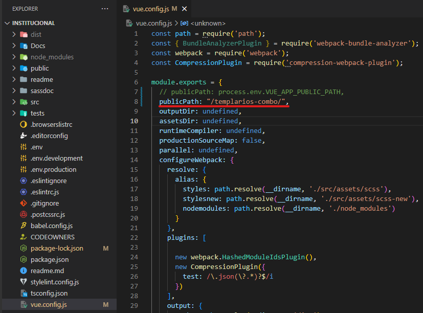
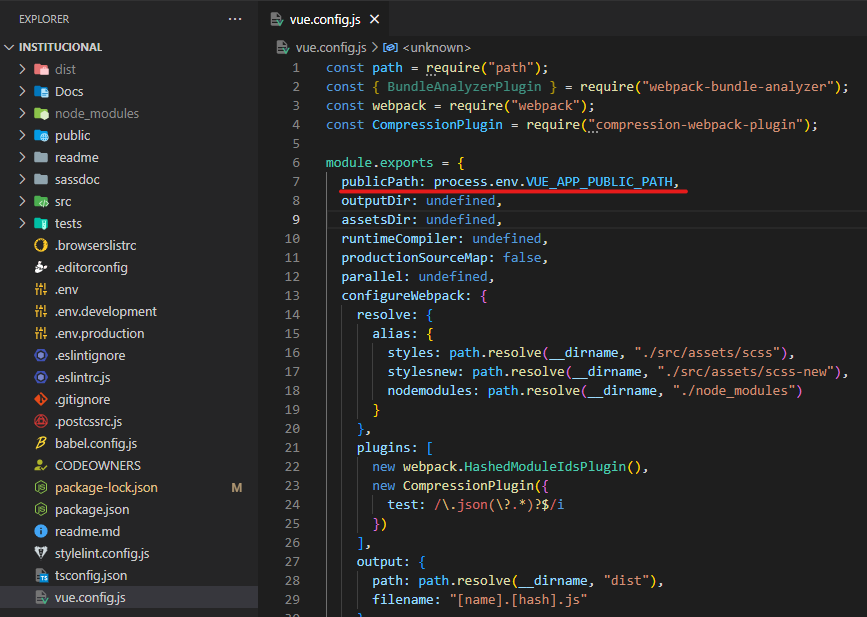

# Institucional (Combos)

- **[Homologação](http://desenv.ordomederi.com/templarios-combo/#/combos)**
- **[Repositório](https://github.com/MEDGRUPOGIT/institucional)**

## Buckets

### FileZila (homologação)

```
templarios-combo
```

## Instalação

```bash
npm install
```

## Desenvolvimento

Utilizar versão do node: **10.9.0**

```
npm start
```

## Publicação homologação

1. No arquivo `vue.config`, alterar `publicPath`:

```javascript
publicPath: "/templarios-combo/",
```



2. Gerar build:

```bash
npm run build:prod
```

3. Publicação ordomederi: enviar pasta dist para Bleggi.

## Publicação produção

1. No arquivo `vue.config`, desfazer a alteração do `publicPath`:

```javascript
publicPath: process.env.VUE_APP_PUBLIC_PATH,
```



2. Time responsável Fenix.
