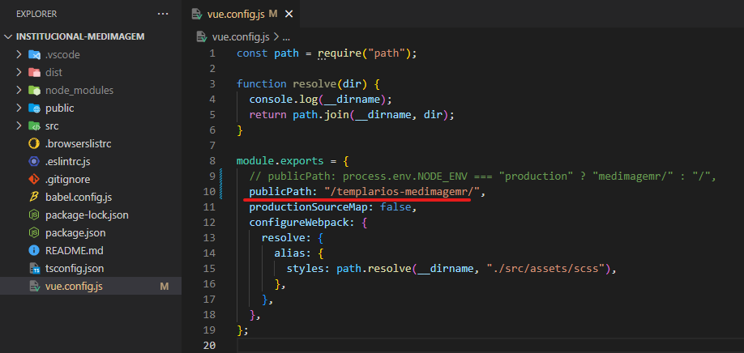
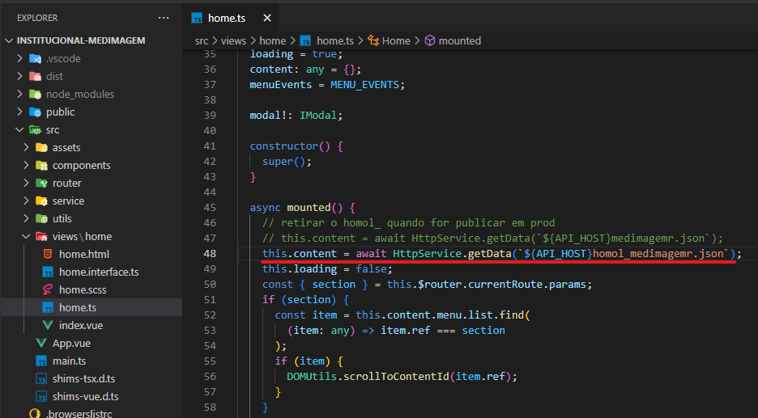
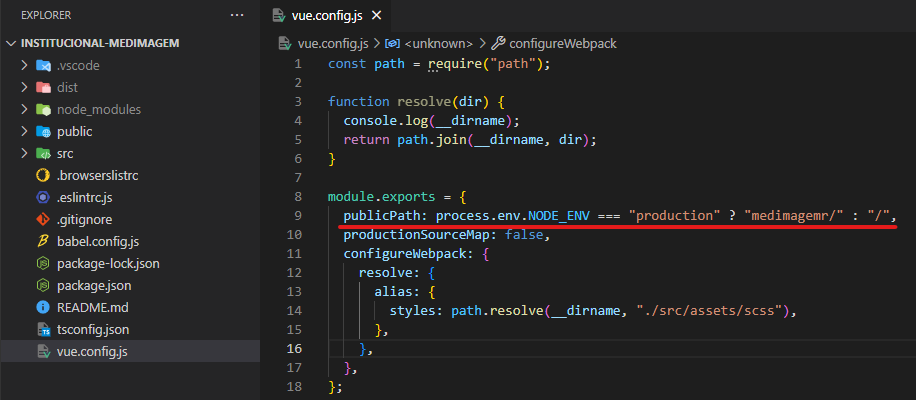
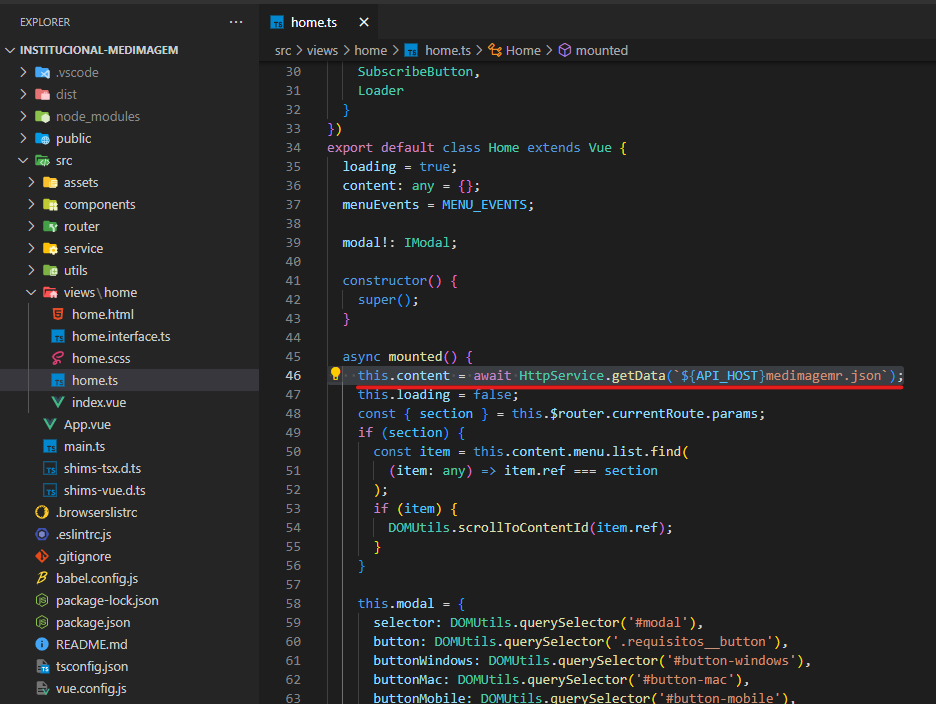

# MEDImagem

- **[Homologação](http://desenv.ordomederi.com/templarios-medimagemr/#/)**
- **[Repositório](https://github.com/MEDGRUPOGIT/institucional-medimagem)**

## Buckets

### CloudBerry (JSON - homologação)

```
MEDGRUPO/med-cdn/templarios-medimagem/homol_medimagem.json
```

### FileZila (homologação)

```
templarios-medimagemr
```

## Instalação

```bash
npm install
```

## Desenvolvimento

Utilizar versão do node: **10.9.0**

```
npm run serve
```

## Publicação homologação

1. No arquivo `vue.config`, alterar `publicPath`:

```javascript
publicPath: "/templarios-medimagemr/",
```



2. Caso tenham sido feitas alterações no arquivo `medimagemr.json` (public/data), alterar arquivo `home.ts`:

```javascript
this.content = await HttpService.getData(`${API_HOST}homol_medimagemr.json`);
```



3. Gerar build:

```bash
npm run build
```

4. Publicação ordomederi: enviar pasta dist e o arquivo `medimagemr.json` (caso tenha sido alterado) para Bleggi.

## Publicação produção

1. Desfazer alterações no arquivo `vue.config`:

```javascript
publicPath: process.env.NODE_ENV === "production" ? "medimagemr/" : "/",
```



2. Caso tenha sido alterado, desfazer alterações no arquivo `home.ts`:

```javascript
this.content = await HttpService.getData(`${API_HOST}medimagemr.json`);
```



3. Time responsável Fenix.
