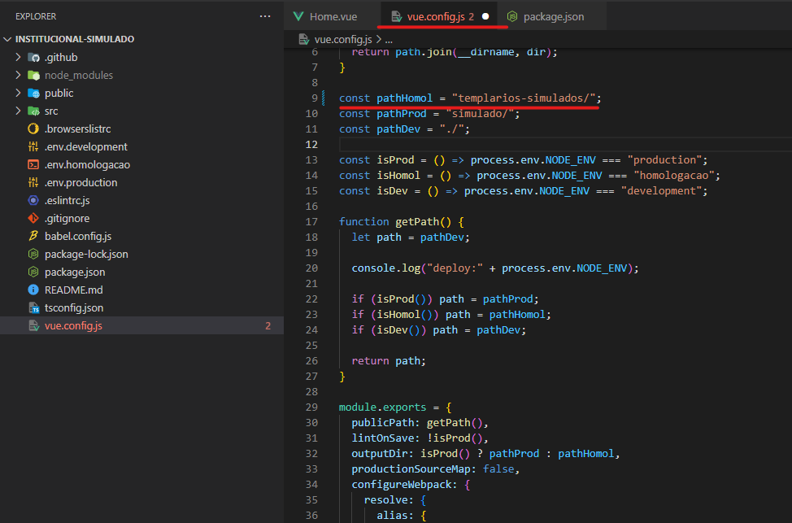
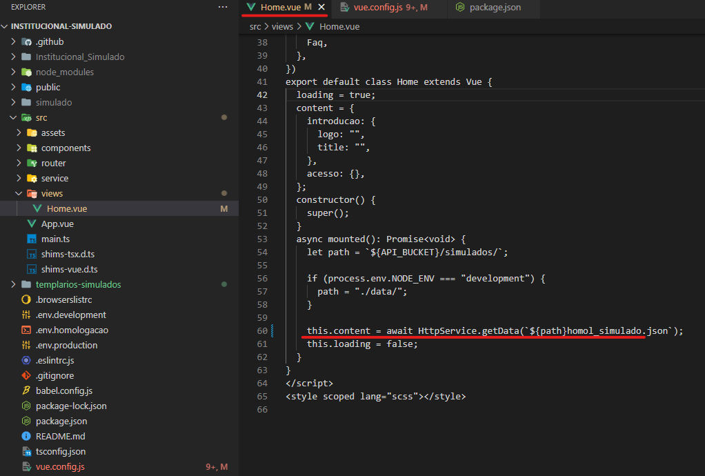
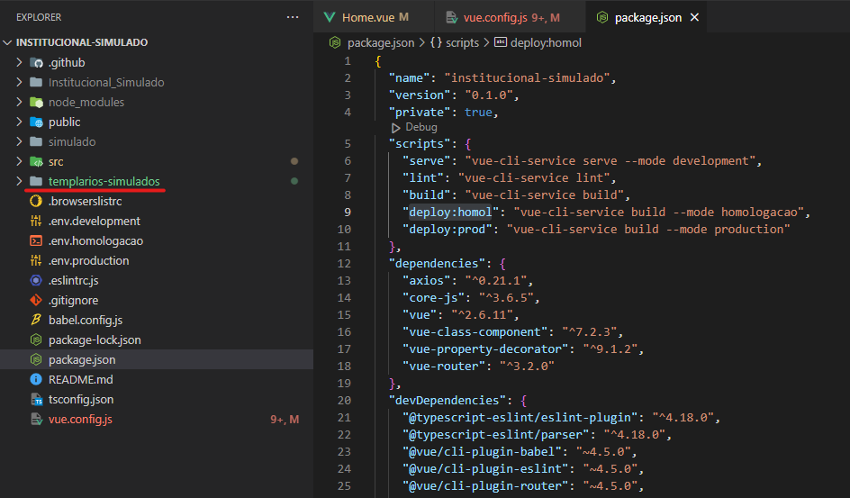
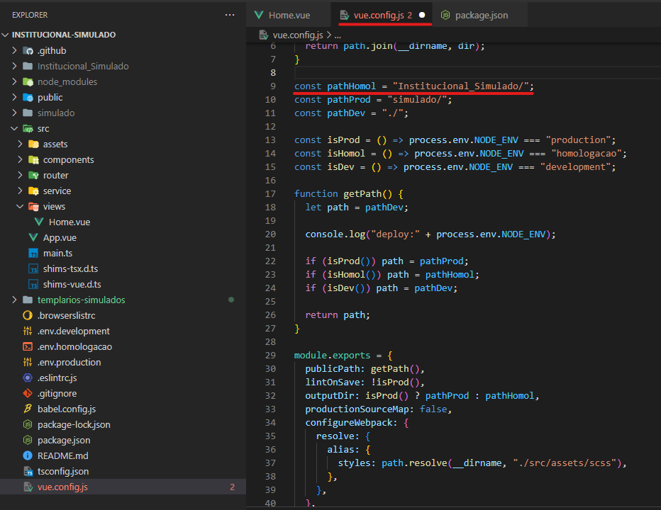
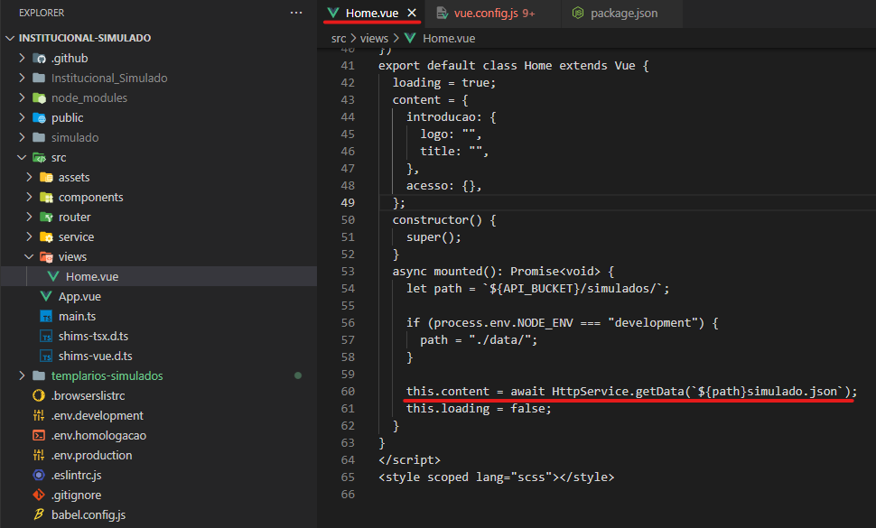

# Simulados

- **[Homologação](http://desenv.ordomederi.com/templarios-simulados/#/)**
- **[Repositório](https://github.com/MEDGRUPOGIT/institucional-simulado)**

## Buckets

### FileZila (homologação)

```
templarios-simulados
```

## Instalação

```bash
npm install
```

## Desenvolvimento

Utilizar versão do node: **14.17.3**

```bash
npm run serve
```

## Publicação homologação

1. No arquivo `vue.config`, alterar `pathHomol`:

```javascript
const pathHomol = "templarios-simulados/";
```



2. No arquivo `Home.vue`, alterar `this.content`:

```javascript
this.content = await HttpService.getData(`${path}homol_simulado.json`);
```



3. Gerar build homol:

```bash
npm run deploy:homol
```

4. Publicação ordomederi: enviar pasta `templarios-simulados` para Bleggi.



## Publicação produção

1. No arquivo `vue.config`, desfazer a alteração do `pathHomol`:

```javascript
const pathHomol = "Institucional_Simulado/";
```



2. No arquivo `Home.vue`, desfazer a alteração do `this.content`:

```javascript
this.content = await HttpService.getData(`${path}simulado.json`);
```



3. Time responsável Fenix.