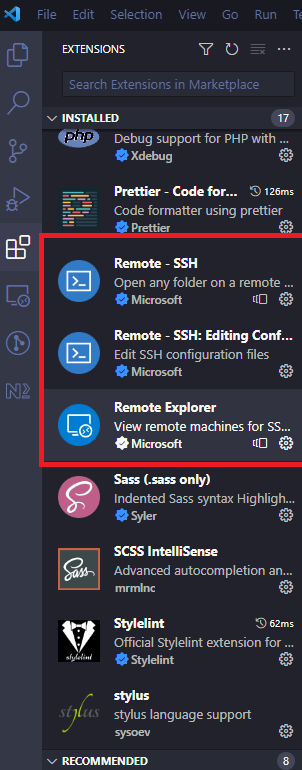
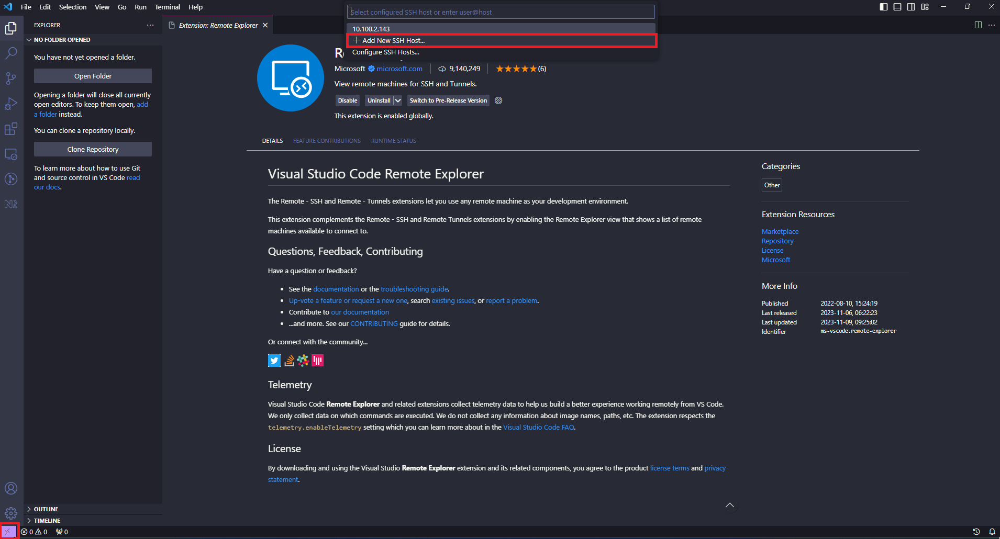
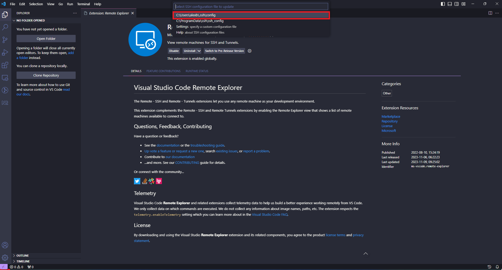
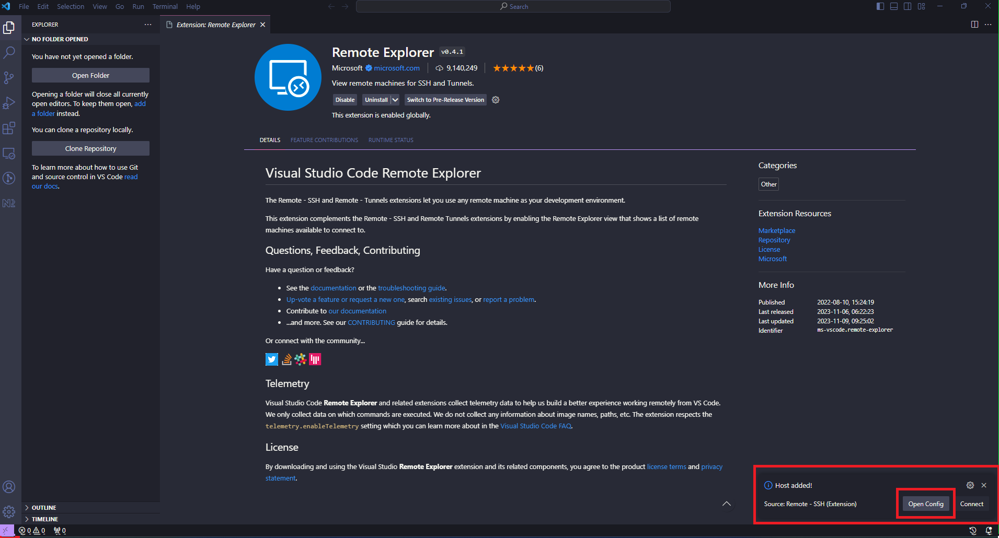
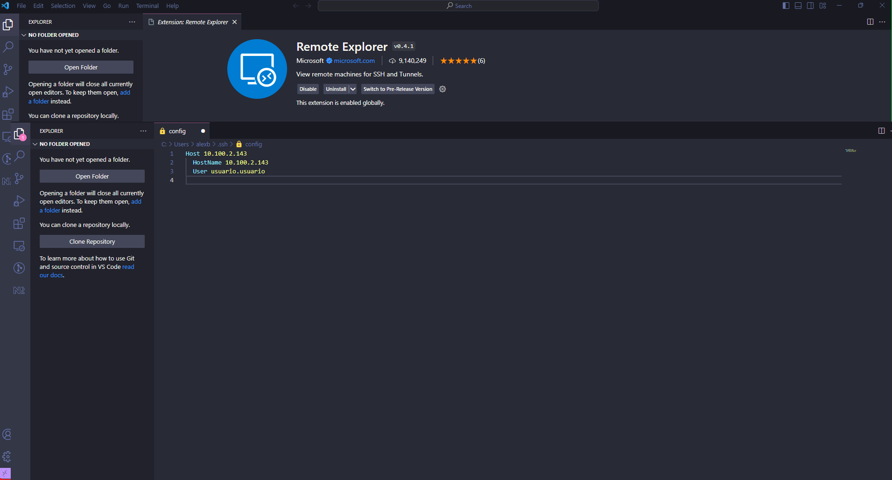
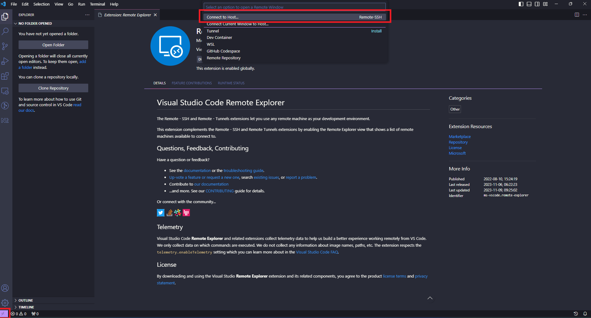
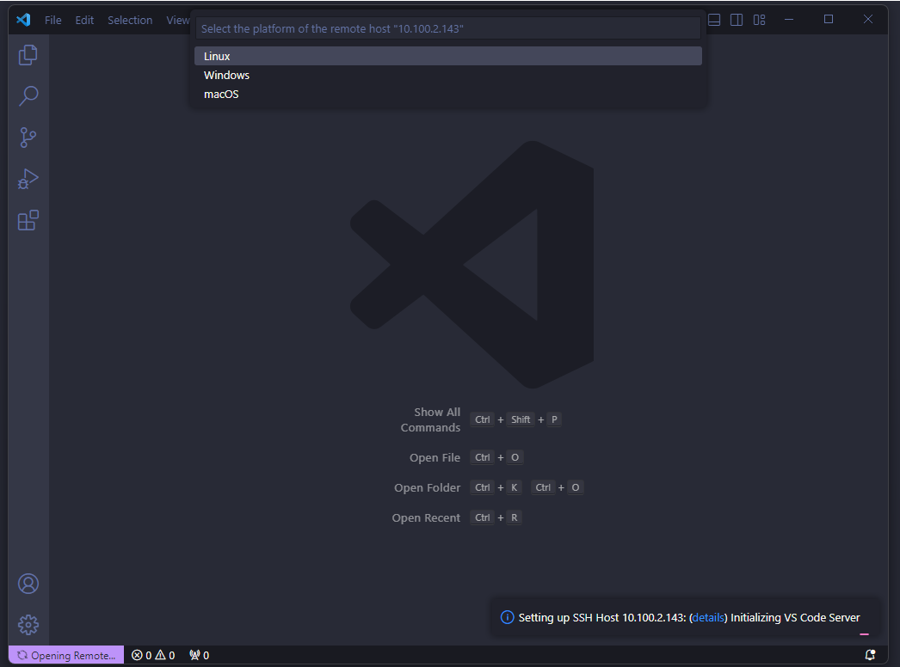
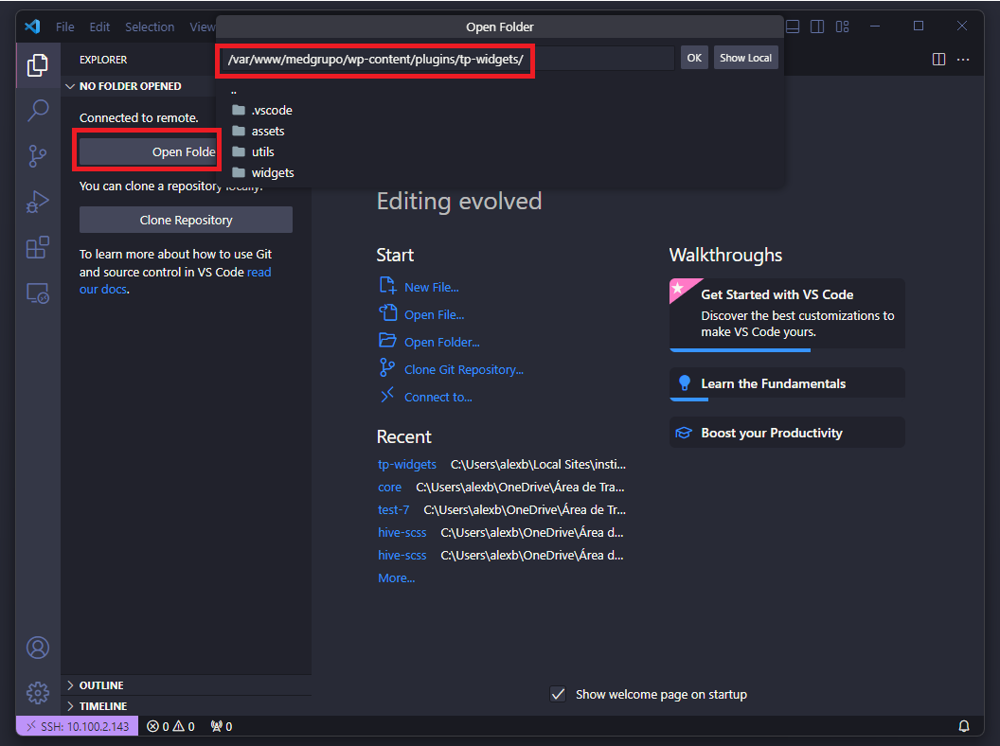

# Produção

## tp-widgets

> Instalar as seguintes extensões:

- **[Remote - SSH](https://marketplace.visualstudio.com/items?itemName=ms-vscode-remote.remote-ssh)**
- **[Remote Explorer](https://marketplace.visualstudio.com/items?itemName=ms-vscode.remote-explorer)**
- **[Remote - SSH: Editing Configuration Files](https://marketplace.visualstudio.com/items?itemName=ms-vscode-remote.remote-ssh-edit)**

### Configuração

> **Step 01: Adicionar um novo SSH Host:**

> **Step 02: Digitar: **ssh usuario@10.100.2.143:**

> **Step 03: Conferir arquivo de configuração:**

### Conecção

> **Step 01: Conectar a VPN**

> **Step 02: Conectar ao Host:**

> **Step 03: Selecionar a opção Linux:**

#### Arquivos PHP

> **Após conectar subir os arquivos necessários**

> **OBS: nunca passar o index.php**

#### Arquivos JS e CSS

> **Subir os arquivos compilados**

## Admin

> **Step 01: Conectar a VPN**

> **Step 02: Conectar no [admin](https://medgrupo.com.br/wp-admin)**

## Elementor

### Configuração

> **<a target="\_blank" href={require('../../static/videos/docs/institucional/institucional-video-01.mp4').default}> Criar nova tela e edição rápida </a>**

> **<a target="\_blank" href={require('../../static/videos/docs/institucional/institucional-video-02.mp4').default}> Elementor - Header, footer e título da tela </a>**

> **<a target="\_blank" href={require('../../static/videos/docs/institucional/institucional-video-03.mp4').default}> Largura do container </a>**

> **<a target="\_blank" href={require('../../static/videos/docs/institucional/institucional-video-04.mp4').default}> Breakpoints </a>**

> **<a target="\_blank" href={require('../../static/videos/docs/institucional/institucional-video-05.mp4').default}> Adicionar cores globais </a>**

> **<a target="\_blank" href={require('../../static/videos/docs/institucional/institucional-video-06.mp4').default}> Selecionar a cor da tela </a>**

> **<a target="\_blank" href={require('../../static/videos/docs/institucional/institucional-video-07.mp4').default}> Seções com duas colunas </a>**

> **<a target="\_blank" href={require('../../static/videos/docs/institucional/institucional-video-08.mp4').default}> Margins e paddings </a>**

> **<a target="\_blank" href={require('../../static/videos/docs/institucional/institucional-video-09.mp4').default}> Clonar uma tela </a>**

### Dicas

> **<a target="\_blank" href={require('../../static/videos/docs/institucional/institucional-video-10.mp4').default}> Como ocultar elementos em determinados breakpoints </a>**

> **<a target="\_blank" href={require('../../static/videos/docs/institucional/institucional-video-11.mp4').default}> Widget desapareceu - possível solução </a>**

> **<a target="\_blank" href={require('../../static/videos/docs/institucional/institucional-video-12.mp4').default}> Trocar ordem de seções </a>**

### Header

> **<a target="\_blank" href={require('../../static/videos/docs/institucional/institucional-video-13.mp4').default}> Largura </a>**

> **<a target="\_blank" href={require('../../static/videos/docs/institucional/institucional-video-14.mp4').default}> Esconder header no scroll e troca de cor </a>**

### Vídeo

> **<a target="\_blank" href={require('../../static/videos/docs/institucional/institucional-video-15.mp4').default}> Válido para todos os widgets que contém vídeo </a>**

### Modal

> **<a target="\_blank" href={require('../../static/videos/docs/institucional/institucional-video-16.mp4').default}> Como criar uma modal - parte 1 </a>**

> **<a target="\_blank" href={require('../../static/videos/docs/institucional/institucional-video-17.mp4').default}> Como criar uma modal - parte 2 </a>**

> **<a target="\_blank" href={require('../../static/videos/docs/institucional/institucional-video-18.mp4').default}> Como criar uma modal - parte 3 </a>**

> **<a target="\_blank" href={require('../../static/videos/docs/institucional/institucional-video-19.mp4').default}> Como criar uma modal - parte 4 </a>**

### Classes CSS

> **<a target="\_blank" href={require('../../static/videos/docs/institucional/institucional-video-20.mp4').default}> border-bottom </a>**

> **<a target="\_blank" href={require('../../static/videos/docs/institucional/institucional-video-21.mp4').default}> section-two-cols-[breakpoint] </a>**

> **<a target="\_blank" href={require('../../static/videos/docs/institucional/institucional-video-22.mp4').default}> blur </a>**

> **<a target="\_blank" href={require('../../static/videos/docs/institucional/institucional-video-23.mp4').default}> ajuste-cards </a>**

### MEDMedia

#### Regras de negócio

- Cada vídeo pertencerá somente a uma categoria, que deve ser definida no mesmo local de inserção dos dados do vídeo.

- Na tela do vídeo, os vídeos recomendados (seção "Você também pode gostar"), serão os vídeos da mesma categoria.

- A ordem da lista de vídeos deve ser conforme a data de postagem deles (mais atuais aparecem antes).

> **<a target="\_blank" href={require('../../static/videos/docs/institucional/institucional-video-24.mp4').default}> Criação de post type </a>**

> **<a target="\_blank" href={require('../../static/videos/docs/institucional/institucional-video-25.mp4').default}> Criação de custom fields </a>**

> **<a target="\_blank" href={require('../../static/videos/docs/institucional/institucional-video-25-1.mp4').default}> Categoria do vídeo </a>**

> **<a target="\_blank" href={require('../../static/videos/docs/institucional/institucional-video-26.mp4').default}> Adicionar um vídeo </a>**

> **<a target="\_blank" href={require('../../static/videos/docs/institucional/institucional-video-27.mp4').default}> medmedia-playlist </a>**

> **<a target="\_blank" href={require('../../static/videos/docs/institucional/institucional-video-28.mp4').default}> video-medmedia </a>**

> **<a target="\_blank" href={require('../../static/videos/docs/institucional/institucional-video-29.mp4').default}> video-playlist com video_id </a>**

> **<a target="\_blank" href={require('../../static/videos/docs/institucional/institucional-video-30.mp4').default}> video-playlist com categoria_id </a>**
