# Medeletro

Clonar repositório a partir do link abaixo:

- **[Repositório](https://github.com/MEDGRUPOGIT/Medeletro)**
## Instalação

```bash
npm install
```

## Configuração

### IOS

Instalação do capacitor

```bash
npm install @capacitor/ios
```

```bash
npx cap add ios
```

>OBS: Em alguns casos a platform IOS ja pode estar adicionada, nesses casos o terminal informará.

Documentação abaixo do Capacitor para consultas:

- **[Documentação Capacitor](https://capacitorjs.com/docs/ios)**

#### Issues

**Problemas relacionados ao processador M1: (**[Link Stackoverflow](https://stackoverflow.com/questions/64698820/ignoring-ffi-1-13-1-because-its-extensions-are-not-built-try-gem-pristine-ffi)**)**

Instalar gem  ffi com o comando abaixo:

```bash
arch -x86_64 sudo gem install ffi --version 1.15.5 --user-install
```

Instalar cocoapods:

```bash
brew install cocoapods
```

### Android

O capacitor é instalado quando as dependências do projeto são instaladas. Não é necessário nenhum passo adicional.

## Desenvolvimento

### Build Serve

Utilizar versão do node: **14.17.3**

```bash
npm start
```

Após rodar este comando o terminal disponibilizará o localhost para abertura no browser.

### Build IOS

Executar o seguinte comando no terminal do projeto.

```bash
npm run build:ios:prod   
```

Abrir o XCode. Para alteração de Devices IOS clicar no campo destacado abaixo:

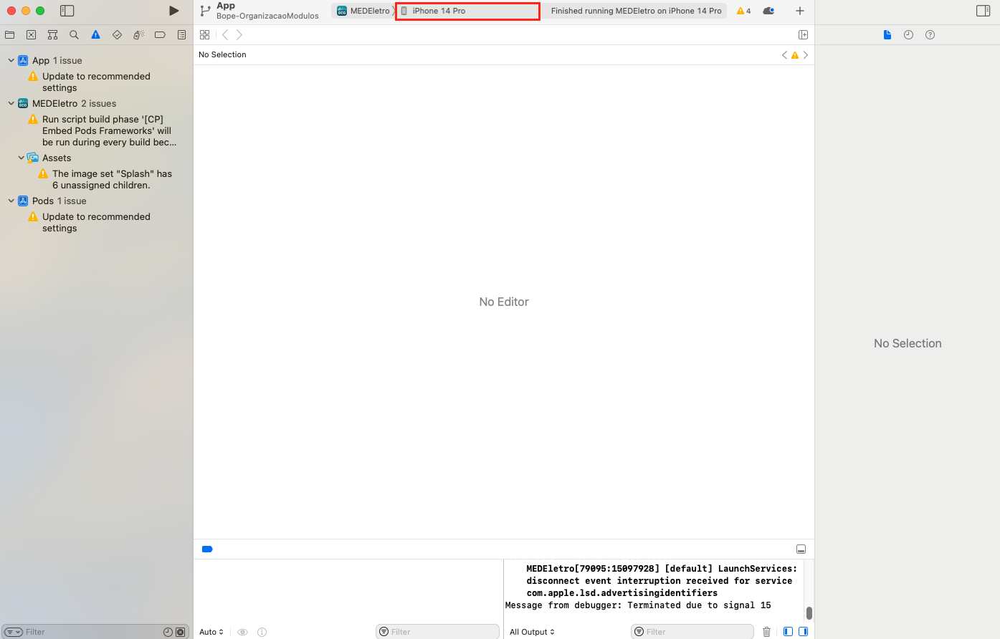

Para executar o XCode e abrir o simulador clicar no campo destacado abaixo:

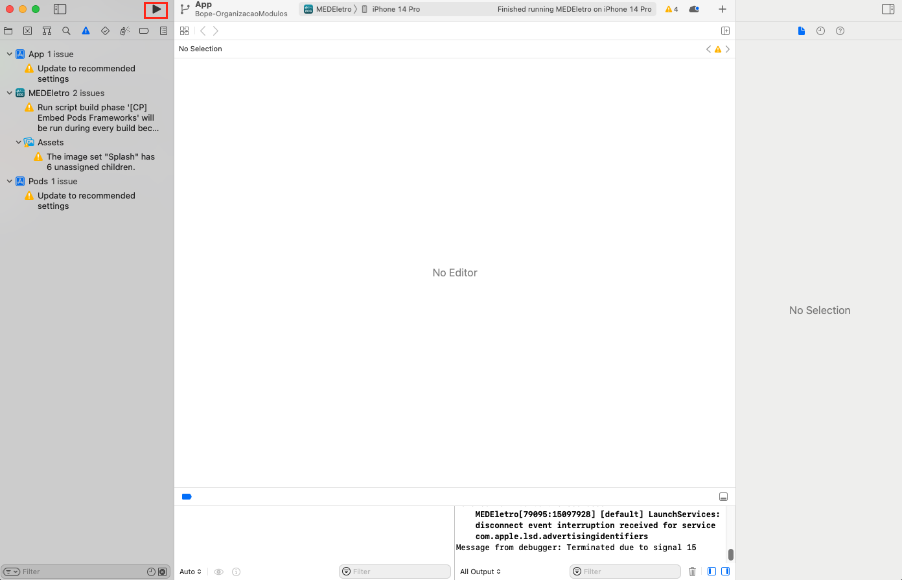

### Build Android

Abrir o Android Studio, clicar em File > Open. Abrir arquivo android na pasta do projeto do Medeletro.

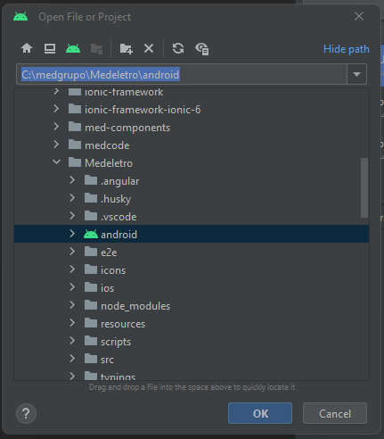

No VSCode, gerar build android:

```bash
npm run build:android
```

Quando acabar de gerar o build, no Android Studio, selecionar o device no qual se deseja rodar o projeto, e clicar no play.

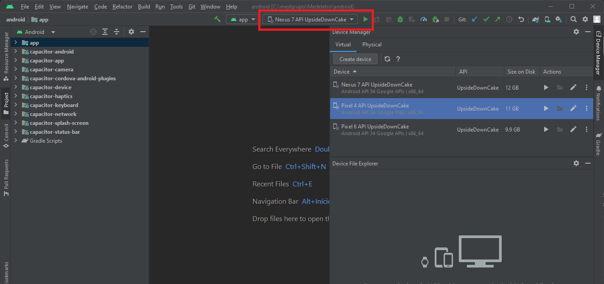

O emulador irá inicializar e abrir o MEDEletro automaticamente.

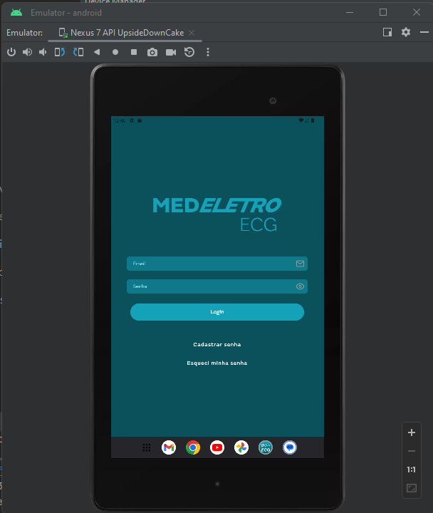

Para inspecionar, abrir Google Chrome na url:

```
chrome://inspect/#devices
```

Clicar em inspect, que aparece abaixo do emulador:

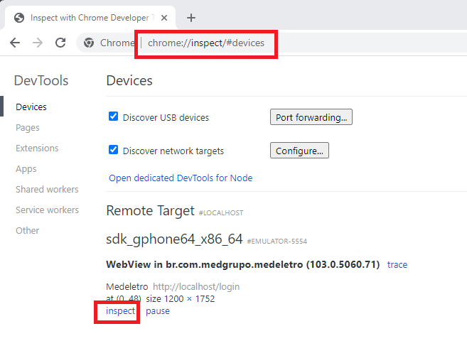

Vai abrir uma janela mostrando a tela do emulador e o inspetor.

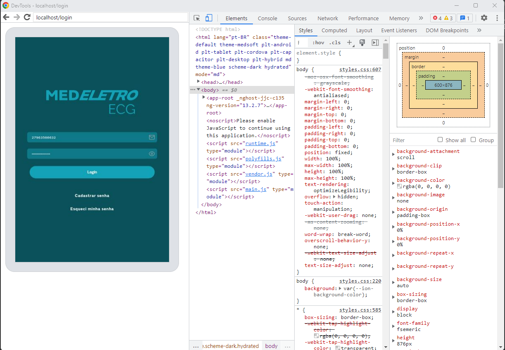

## Builds para teste

### Build IOS

#### Build homol

Abrir AnyDesk e abrir o projeto do Medeletro no VSCode. Rodar os seguintes comandos no terminal:

```bash
curl -o- https://raw.githubusercontent.com/nvm-sh/nvm/v0.39.1/install.sh | bash
```

```bash
export NVM_DIR="$HOME/.nvm" [ -s "$NVM_DIR/nvm.sh" ] && \. "$NVM_DIR/nvm.sh"  # This loads nvm
```

```bash
nvm use 14.15.1
```

Para buildar em homol:
```bash
npm run build:ios
```

XCode vai abrir automaticamente. No campo do dispositivo, selecionar "Any IOS Device".

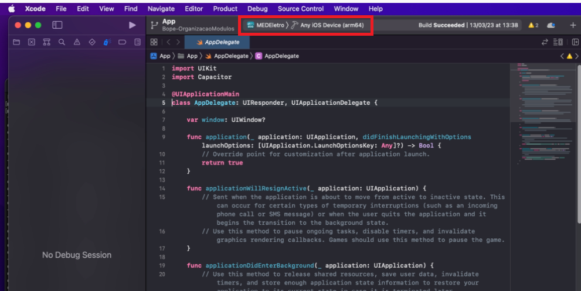

Se for necessário trocar a versão do app, clicar em App no canto superior esquerdo. Em General > Identity > Version, colocar o número atualizado da versão.

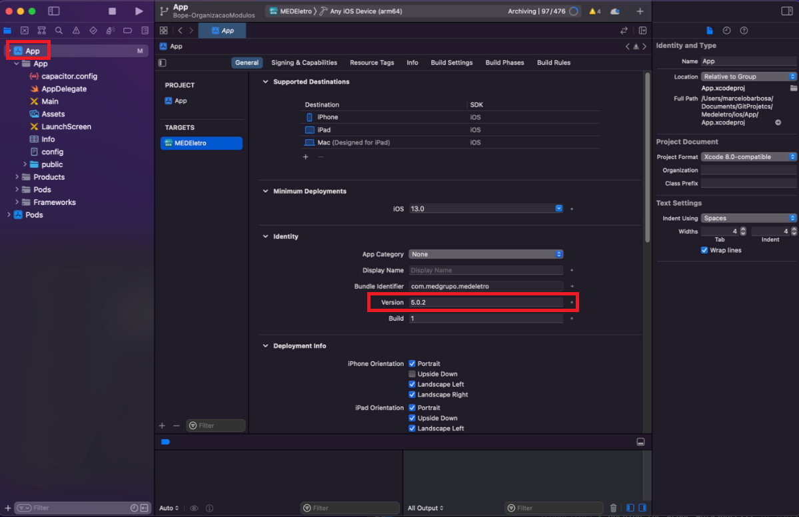

Clicar em Product > Archive.

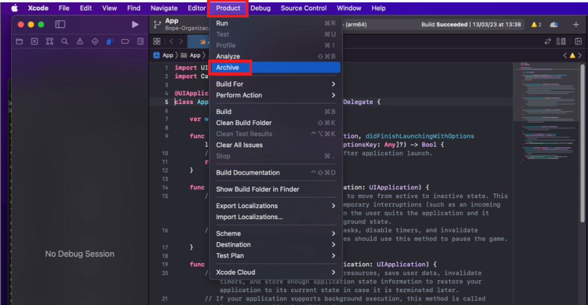

Vai abrir uma janela com os builds existentes. Selecionar o build que foi feito e clicar em Distribute App.

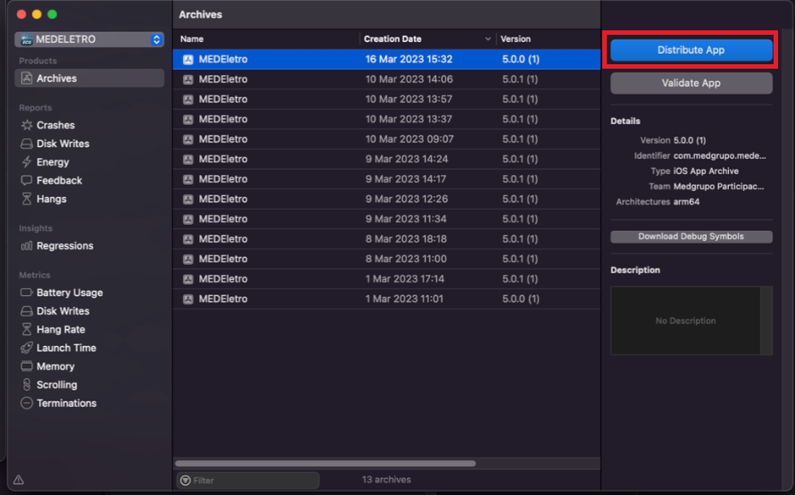

Selecionar development e clicar em Next.

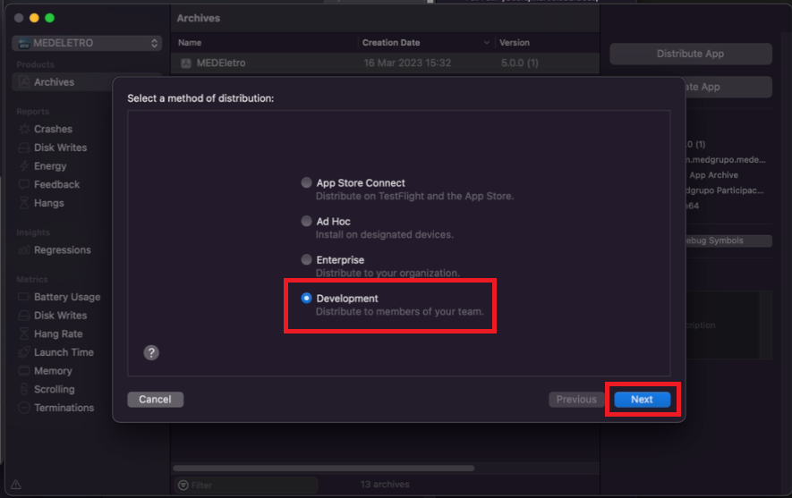

Nas duas próximas janelas clicar em "Next" e depois em "Export".

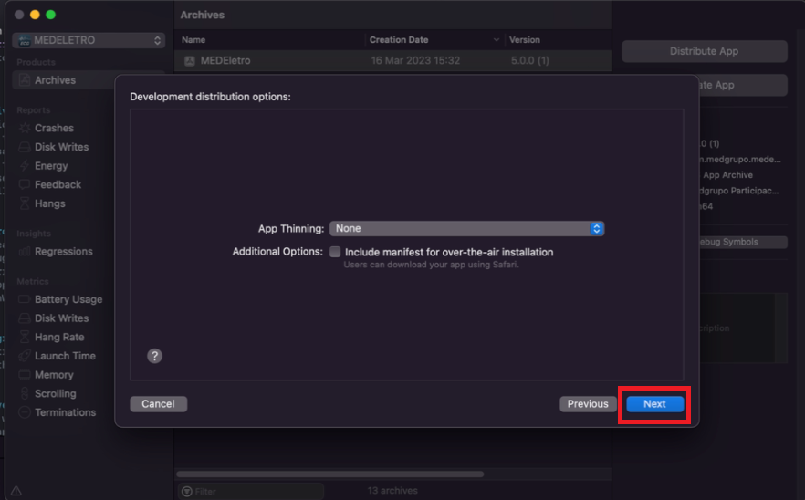

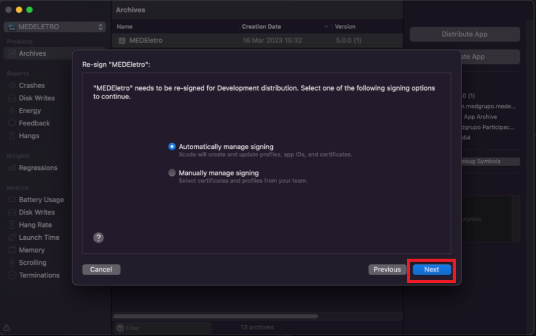

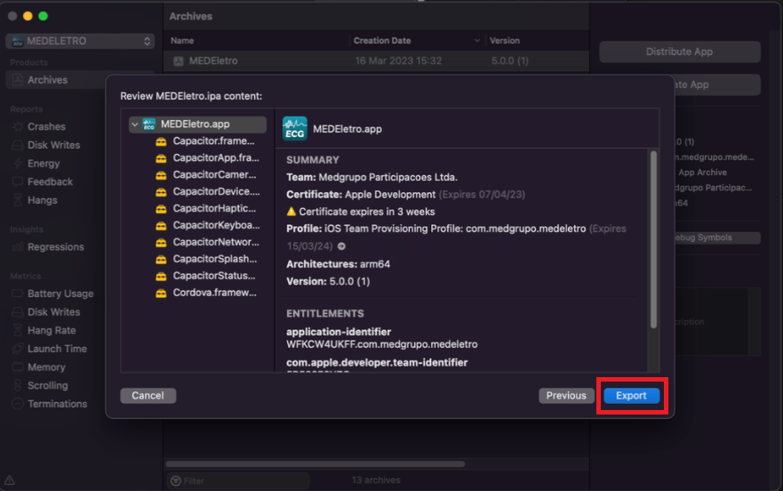

Abrir Finder > Documentos > Dist para localizar o build gerado.

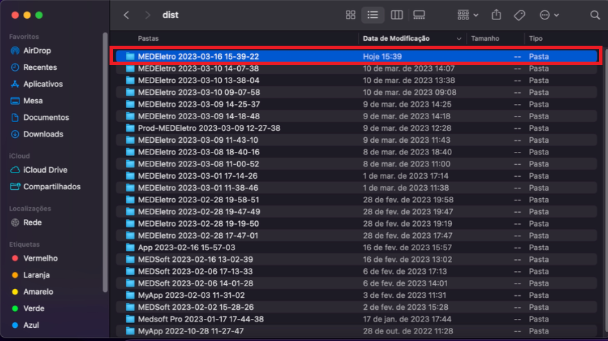

Dentro da pasta do build gerado, localizar o aquivo .ipa.

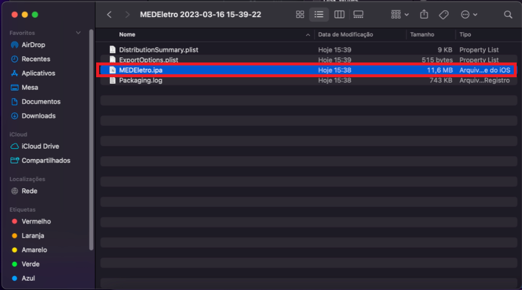

Para gerar o link para download do app, ver seção **Diawi** em Outros.

#### Build prod

Repetir os mesmos passos do build em homol, com uma única diferença, para buildar em prod, rodar no terminal:

```bash
npm run build:ios:prod
```

Para gerar o link para download do app, ver seção **Diawi** em Outros.

### Build Android

#### Build homol

Abrir o Android Studio, clicar em File > Open. Abrir arquivo android na pasta do projeto do Medeletro.

No VSCode, gerar build android:

```bash
npm run build:android
```

Quando acabar de gerar o build, no Android Studio, clicar em Build > Build Bundle(s) / APK(s) > Build APK(s).

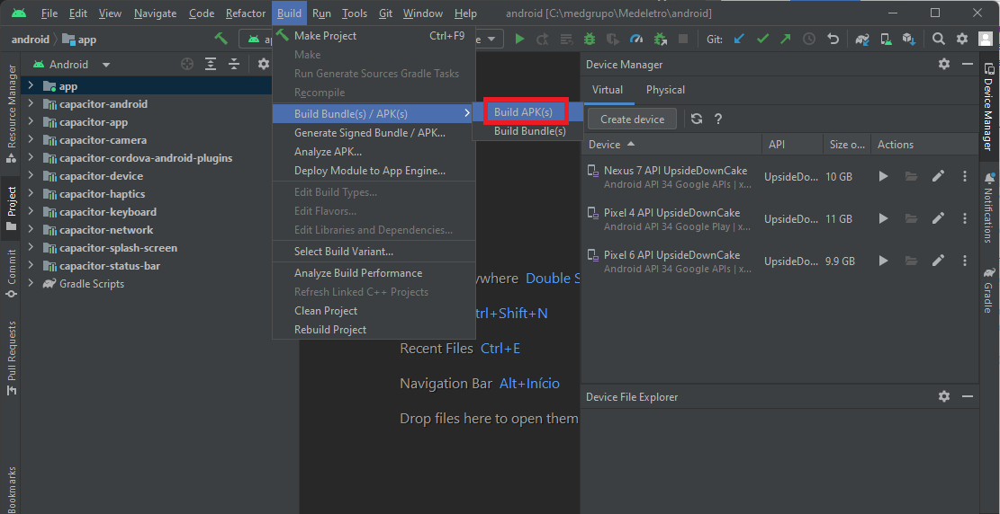

Quando terminar de gerar o arquivo .apk, no canto inferior direito irá aparecer um pop-up, clicando em "locale" irá abrir a pasta onde está localizado o arquivo .apk.

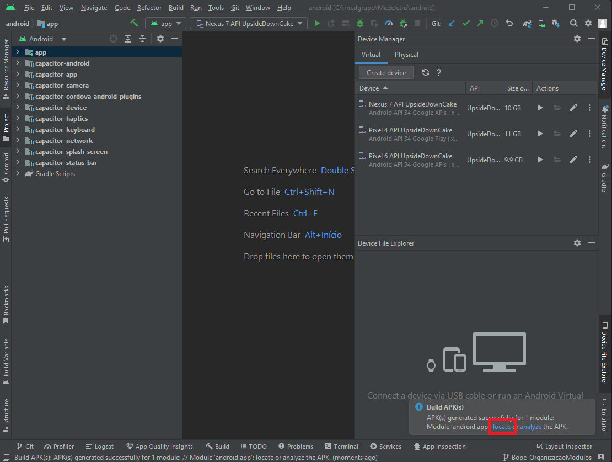

Alternativamente, pode-se localizar o arquivo .apk dentro do projeto do MEDEletro (Medeletro\android\app\build\outputs\apk\debug).

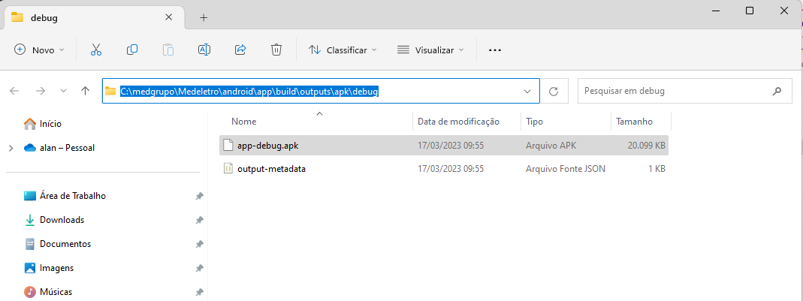

Para gerar o link para download do app, ver seção **Diawi** em Outros.

#### Build prod

Repetir os mesmos passos do build em homol, com uma única diferença, para buildar em prod, rodar no terminal:

```bash
npm run build:android:prod
```

Para gerar o link para download do app, ver seção **Diawi** em Outros.