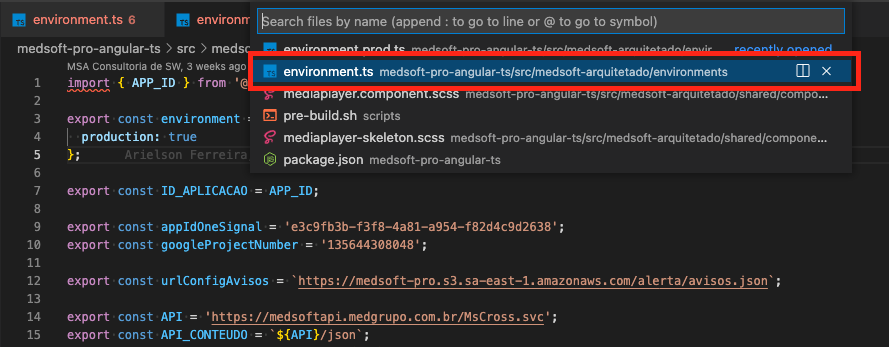
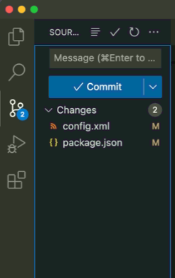
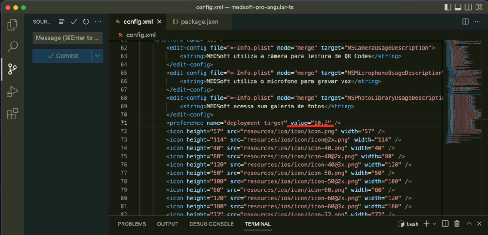
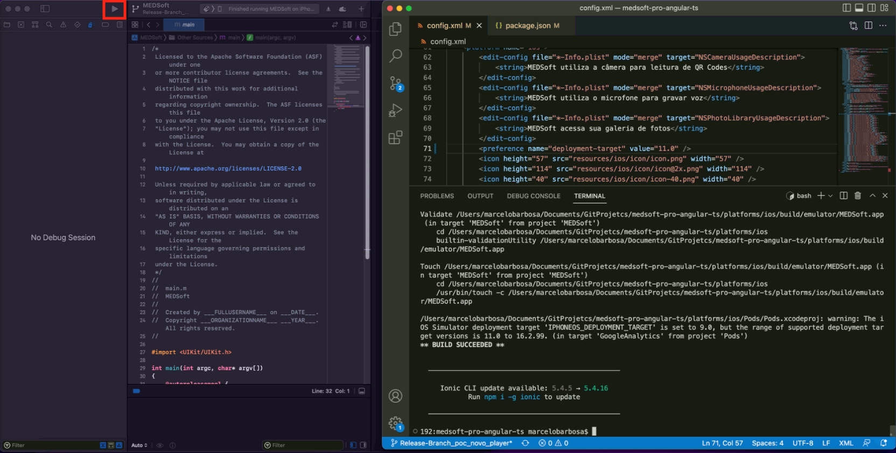
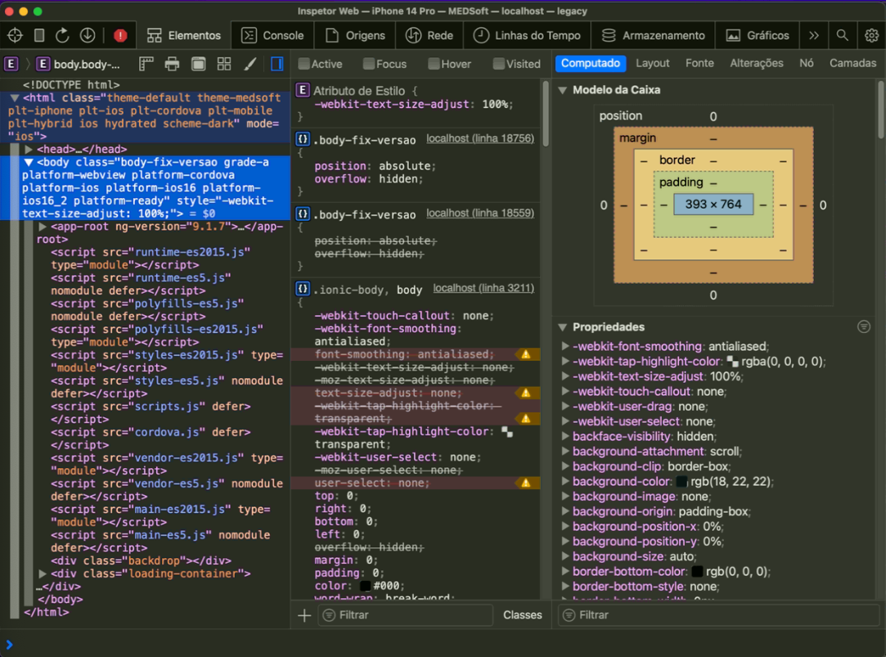
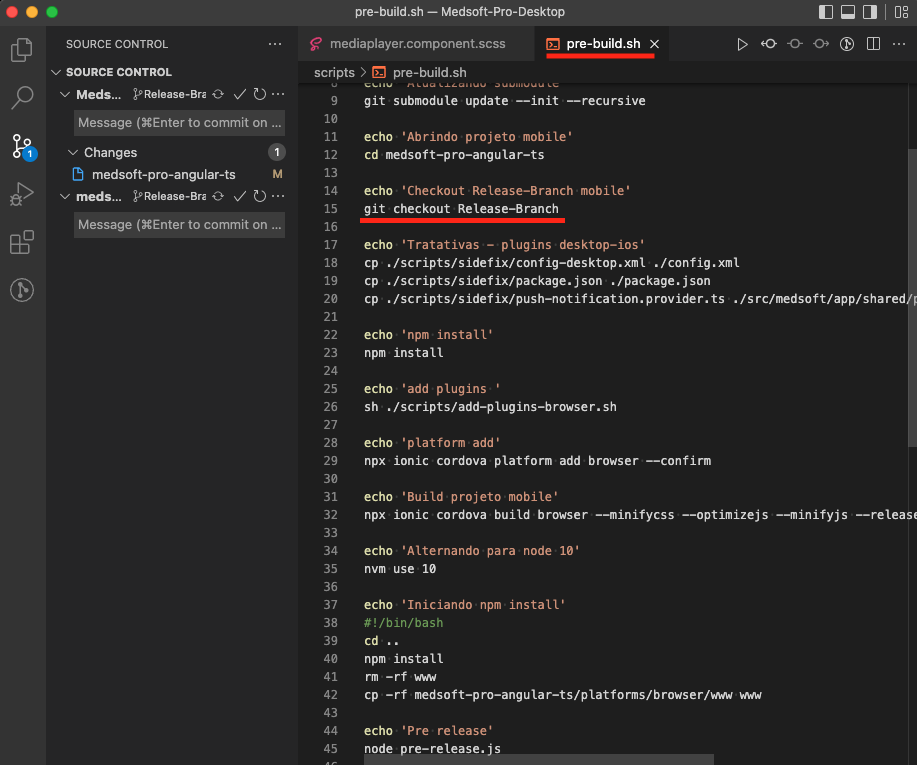
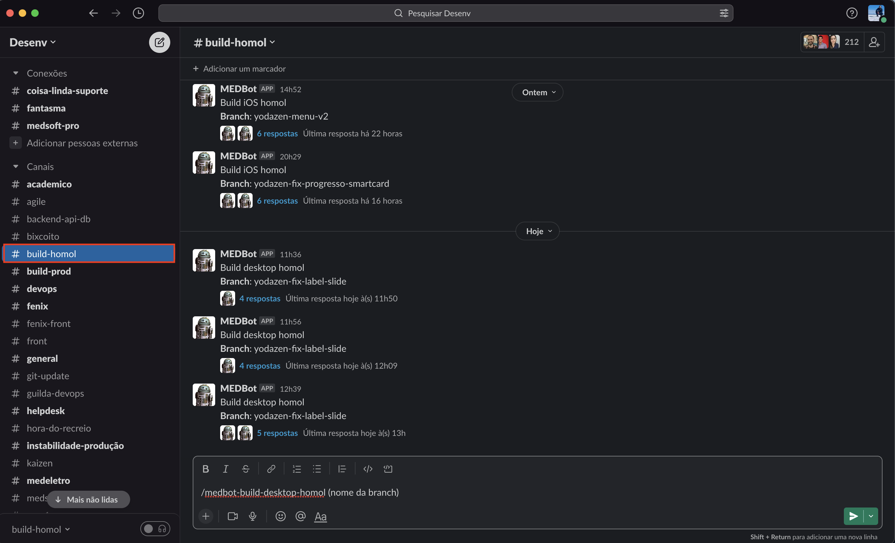
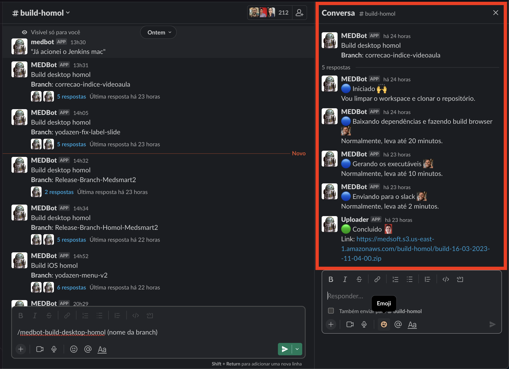
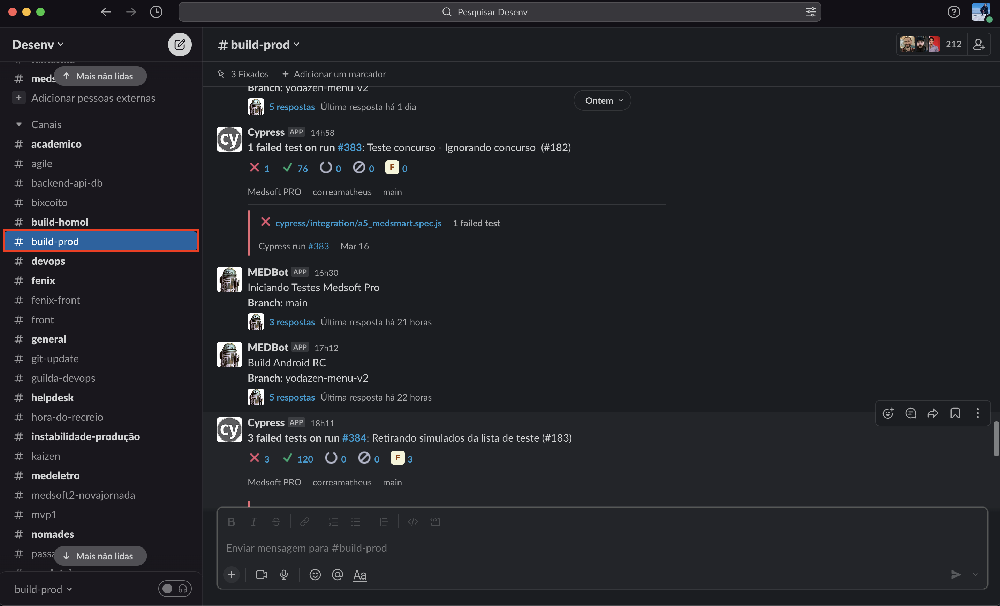

# Medsoft

Clonar repositório através do link abaixo:

- **[Repositório](https://github.com/MEDGRUPOGIT/Medsoft-Pro-Desktop)**
## Instalação

Entrar na Branch Release-Branch:

```bash
git checkout Release-Branch
```

Executar o comando abaixo no terminal:

```bash
git submodule update --init --recursive
```

Entrar na pasta medsoft-pro-angular-ts:

```bash
cd medsoft-pro-angular-ts
```

Confirmar que dentro desta pasta também esta na Release-Branch:

```bash
git checkout Release-Branch
```

Instalar as dependencias do projeto:

```bash
npm install
```

Executar o comando abaixo no terminal:

```bash
ionic cordova build browser
```

Retornar para a pasta medsoft-pro-desktop

```bash
cd ..
```

Instalar as dependencias desta pasta:

```bash
npm install
```
## Configuração

Utilizar a versão do node 14.17.3

Utilizar cordova versão 8.0.0

Utilizar ionic versão 5.4.5

Utilizar a versão do npm 6.14.13

:::note
Algumas dessas versões ja podem estar sendo utilizadas após o processo de instalação. Verificar com o comando abaixo qual a versão em uso:
:::

Ex:
```bash
cordova -v
```
## Desenvolvimento
### Serve

Entrar na pasta medsoft-pro-angular-ts:

```bash
cd medsoft-pro-angular-ts
```

Executar o comando abaixo:

```bash
npx ionic serve
```

:::note
Caso nao consiga logar após carregamento da pagina por motivos como **"serviço indisponivel" ou similares**, talvez seja necessário trocar os Environments conforme abaixo:
:::

1. Abrir os arquivos environment.ts e environment.prod.ts **(ambos da pasta medsoft-arquitetado)**:



2. Copiar todo o conteúdo do environment.prod.ts 

3. Apagar todo o conteúdo do environment.ts e colar os conteúdo que foi copiado do environment.prod.ts.

4. Salvar e executar novamente.

:::caution
 **NÃO COMMITAR ESSA ALTERAÇÃO.** Após testes/verificações, reverter o arquivo para o original !
:::

:::note
Este processo pode ser feito para as demais execuções (Eletron e IOS).
:::

### Electron

Retornar se necessario para a pasta Medsoft-Pro-Desktop

```bash
cd ..
```

Executar o comando abaixo:

```bash
npm run bee
```
### Android Studio

1. lorem ipsum

### XCode

Utilização via Anydesk

1. Discartar arquivos modificados



2. Mudar para Branch desejada:

```bash
git checkout (nome da branch)
```

```bash
git pull
```

:::note
Talvez seja necessario dar git pull na Release-Branch para ter acesso a branch desejada.
:::

3. No arquivo config.xml, na linha 71 trocar o value para 11.0:

```
value="11.0"
```


4. Executar a sequencia de comandos abaixo no terminal:

```bash
ionic cordova platform rm ios
```

:::note
Se estiver com o XCode aberto ele irá solicitar o fechamento do software.
:::

```bash
ionic cordova platform add ios
```

```bash
sudo npm i -g cordova-res
```

Senha: meddesenv!12

:::note
Neste comando ocorrerá um erro que deve ser ignorado. Continuar seguindo a sequencia.
:::

5. Abrir XCode através do caminho abaixo:

> Abrir: Finder -> Documentos -> GitProjetos -> medsoft-pro-angular-ts -> platforms -> ios -> **MEDSoft.xcworkspace**:


6. Executar o comando abaixo no terminal para fazer o build do projeto.

```bash
ionic cordova build ios
```

7. Após **build succeeded**, dar play no XCode:



:::note
Caso seja necessario, trocar device no XCode para testes.
:::
#### Inspetor do simulador:

1. Abrir o Safari.

2. no Painel de ferramentas na parte superior da tela, escolher a opção **Desenvolvedor**, selecionar **Simulador (nome do device escolhido)**, clicar em **localhost**:


Inspecionar através do inspetor do safari:


## Builds para teste

### Para Desktop

1. Entrar no Projeto Medsoft-Pro-Desktop.

2. Criar uma Branch a partir da Release-Branch com o mesmo nome da branch de trabalho (ex.: git checkout correcao-videoaula).

3. Alterar a linha 15 do arquivo pre-build.sh (trocar Release-Branch pelo nome da Branch criada):



4. Commitar e dar Push.

5. No Slack selecionar o Canal build-homol:



6. Inserir o comando abaixo para que o bot inicie o processo de criação do build desktop:

```
/medbot-build-desktop-homol (nome da branch)
```

:::note
Acompanhar na thread a evolução do processo. Se ao fim do processo o build for bem sucedido, o bot enviará o link do Build:
:::



### Para IOS

1. No Slack selecionar o Canal build-homol:


2. Inserir o comando abaixo para que o bot inicie o processo de criação do build IOS:

```
/medbot-build-IOS-homol (nome da branch)
```

:::note
Acompanhar na thread a evolução do processo. Se ao fim do processo o build for bem sucedido, o bot enviará o link do Build:
:::


### Para Android

Devido problemas no bot de build-homol, o build de Android deve ser feito através do canal build-prod.

1. Abrir os arquivos environment.ts e environment.prod.ts **(ambos da pasta medsoft-arquitetado)**:


2. Copiar todo o conteúdo do environment.ts 

3. Apagar todo o conteúdo do environment.prod.ts e colar o conteúdo que foi copiado do environment.ts.

4. Salvar, commitar e dar push.

5. No Slack selecionar o Canal build-prod:



6. Inserir o comando abaixo para que o bot inicie o processo de criação do build Android:

```
/medbot-build-android-rc (nome da branch)
```

:::note
Acompanhar na thread a evolução do processo. Se ao fim do processo o build for bem sucedido, o bot enviará o link do Build:
:::


:::caution
**APÓS BUILD CRIADO, REVERTER O ENVIRONMENT QUE FOI ALTERADO, COMMITAR E DAR PUSH.**
:::

