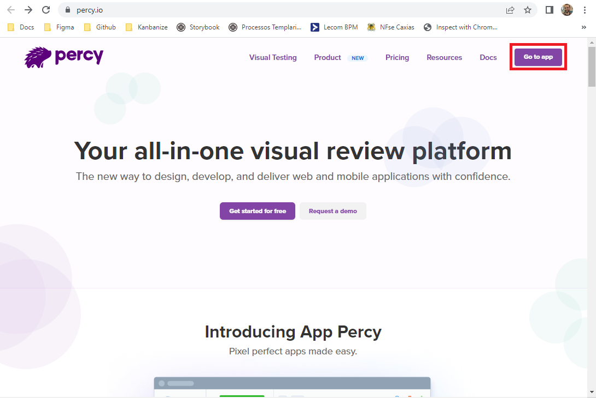
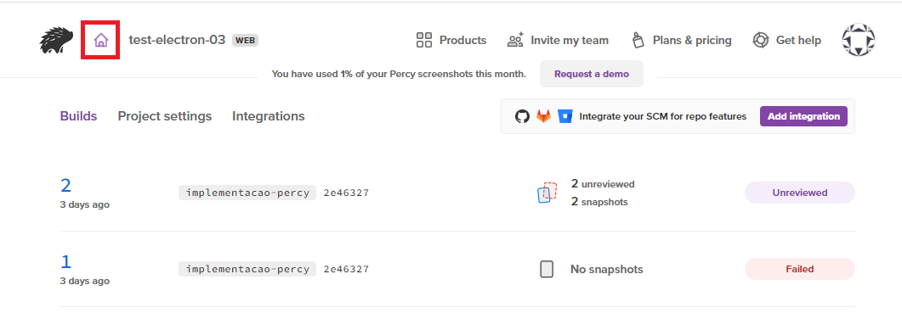
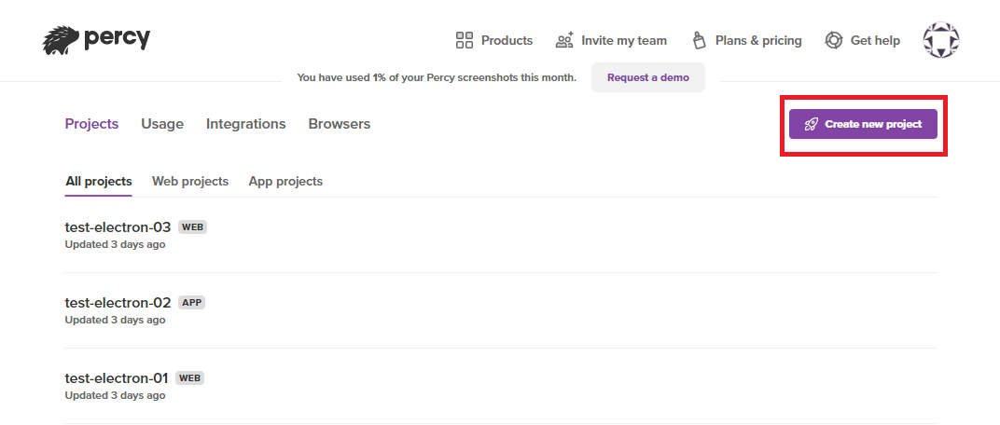
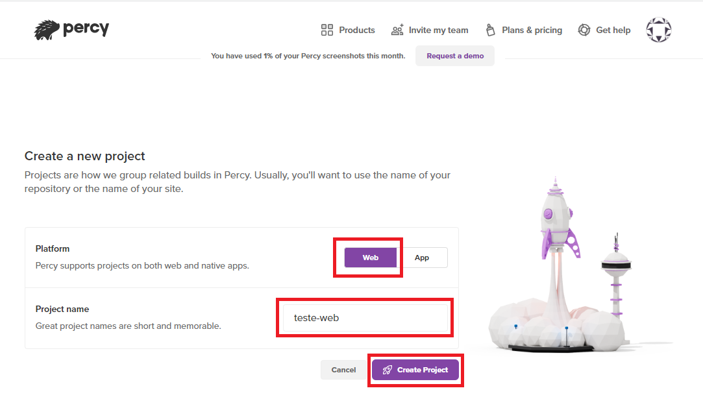
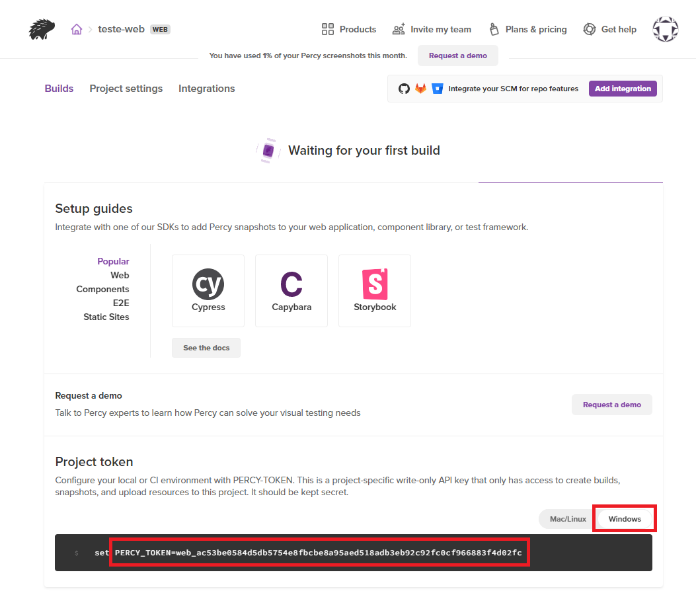

# Visual Regression Tests - Creating Project

## Web

1. Criar pasta chamada web. Abrir essa pasta no VSCode. Para criar arquivo `package.json`, no terminal, rodar o comando:

```bash
npm init -y
```

2. Adicionar as dependências do projeto:

```bash
npm install cypress
```

```bash
npm install @percy/cypress
```

```bash
npm install --save-dev @percy/cli
```

```bash
npm install --save-dev dotenv
```

3. É necessário ter um usuário no **[percy.io](https://percy.io)**. 

4. Com o usuário logado no **[percy.io](https://percy.io)**, criar novo projeto, seguindo o fluxo abaixo:







5. Selecionar Platform Web e dar nome o projeto.



6. No Project Token selecionar o sistema operacional no qual será rodado o teste (Mac/Linux ou Windows), e copiar o PERCY_TOKEN fornecido.




Na raíz do projeto criar arquivo `.env` e inserir o percy token (é necessário criar um usuário em **[percy.io](https://percy.io)**).


## Electron

## Android

## IOS

