# Android Studio

- **[Site Android Studio](https://developer.android.com/studio)**

## Instalação

Entrar no site do **[Android Studio](https://developer.android.com/studio)**:

```
https://developer.android.com/studio
```

Clicar em download. Baixar e instalar o Android Studio.

## Configurações

### Gradle

Entrar no site do **[Gradle](https://gradle.org/releases/)**:

```
https://gradle.org/releases/
```

Baixar e instalar a versão 7.1.1 (complete).

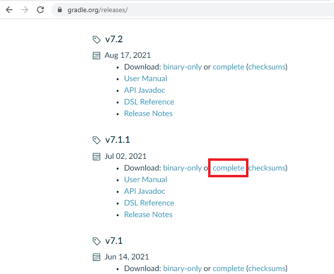

Extrair todos os arquivos do gradle-7.1.1-all.zip.

### Variáveis de ambiente

Configurar as variáveis de ambiente ANDROID_HOME e JAVA_HOME, tanto nas variáveis do usuário quanto nas variáveis do sistema.


:::note

Ajustar o path das pastas e arquivos conforme consta no seu computador.

:::

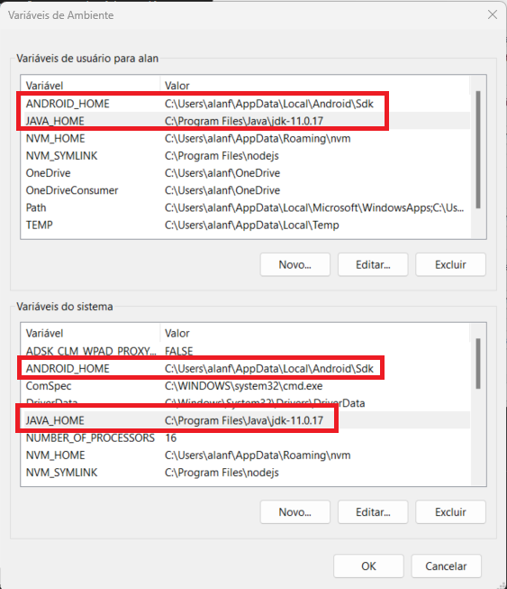

Configurar as variáveis de ambiente do Path, até a pasta bin do gradle 7.1.1, tanto nas variáveis do usuário quanto nas variáveis do sistema.

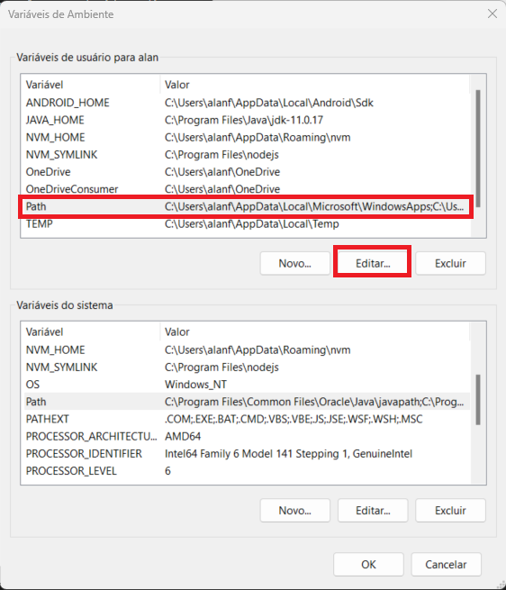

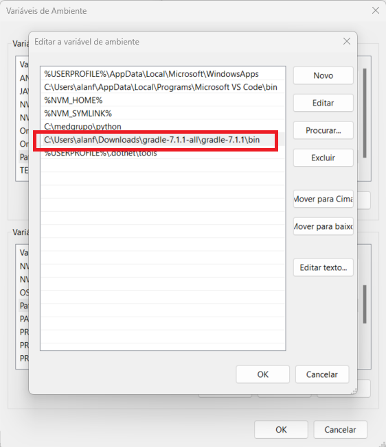

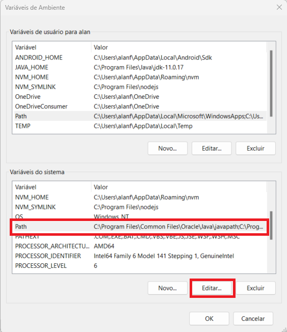

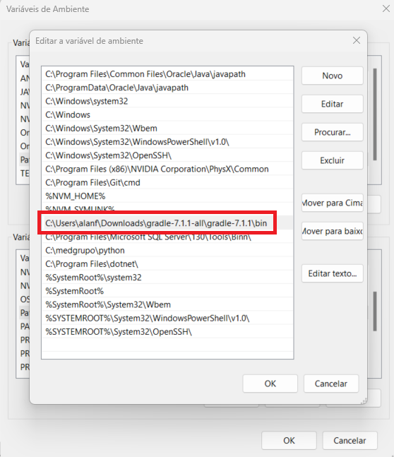

### SDK

No Android Studio, clicar em SDK Manager

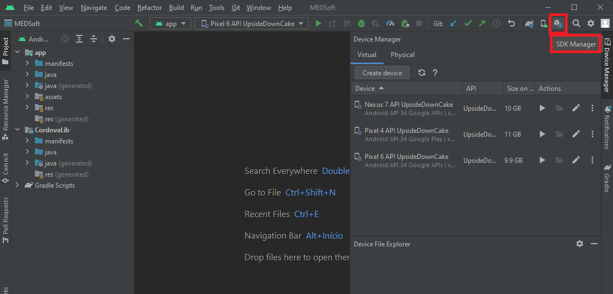

Appearance & Behavior > System Settings > Android SDK

Em SDK Tools, clicar no checkbox Show Package Deails (canto inferior direito), em Android SDK Build-Tools, selecionar a versão 32.0.0 e instalar.

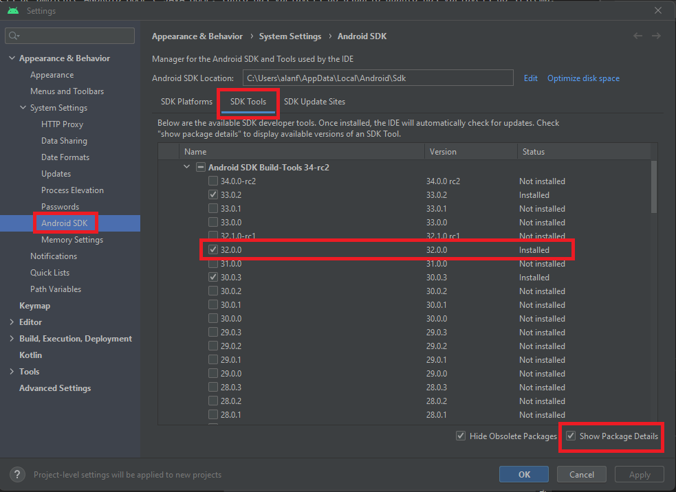

## Adicionar device

Device Manager > Virtual > Create device

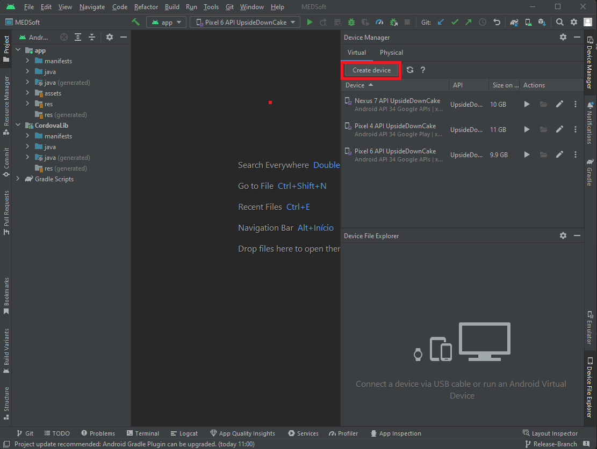

Selecionar a categoria, o modelo do device, e clicar em Next.

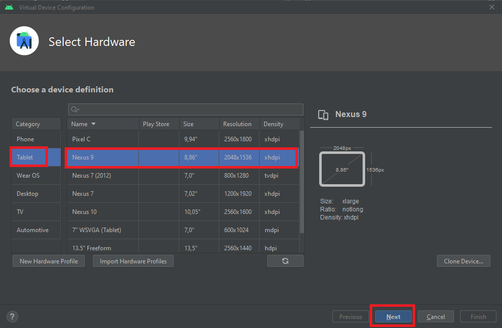

Selecionar o sistema operacional desejado e clicar em Next.

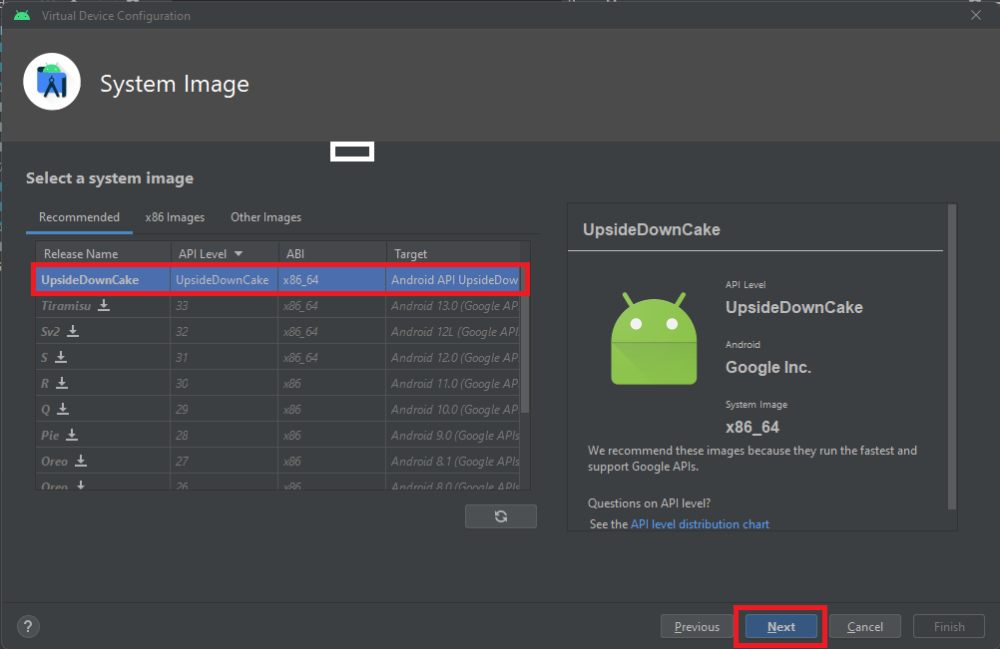

Selecionar a orientação da tela quando o device é inicializado e clicar em Finish.

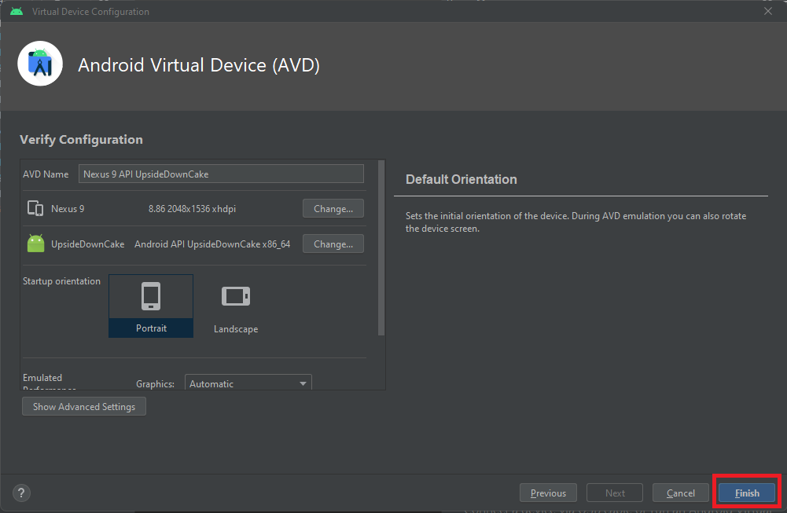

O novo device vai aparecer na lista dos devices virtuais no Device Manager.

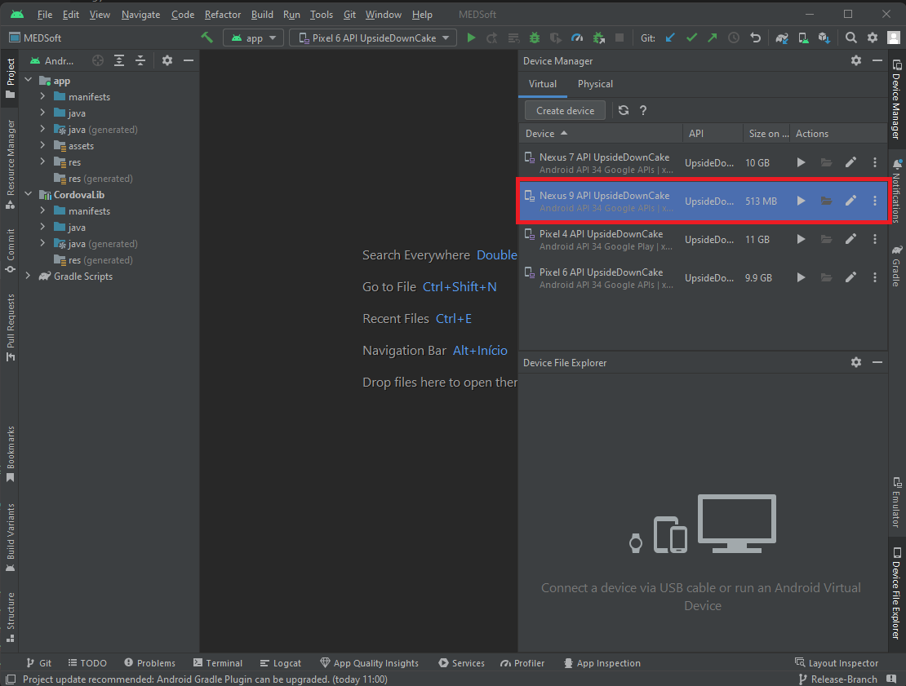