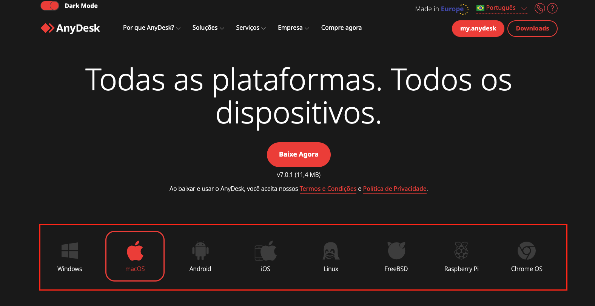
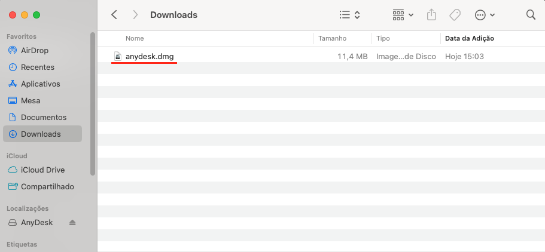
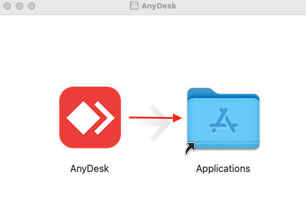
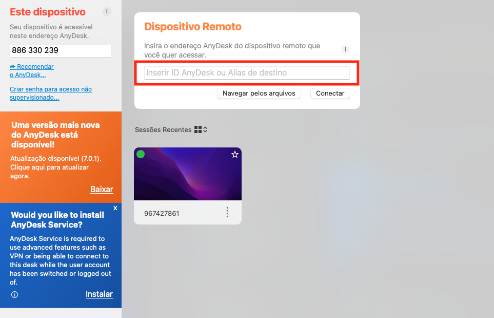
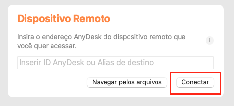

# AnyDesk

- **[Site AnyDesk](https://anydesk.com/pt/downloads/mac-os)**

## Instalação

### MAC

Selecione o sistema operacional de sua utilização:



Após selecionar o sistema operacional, clique em **"BAIXAR AGORA"**.

Após o download completo abrir o arquivo no Finder:



Arraste o Icone AnyDesk para a pasta Application:


### Windows

### Linux

## Desenvolvimento

Inserir ID do Computador que deseja acessar no campo destacado abaixo:



ID MAC Brandão:

```
967427861
```

Senha: meddesenv!12

Clicar em Conectar:



## Úteis

É possivel que o seu teclado não esteja sincronizado com o teclado da máquina que esta acessando. Neste caso clique no ícone destacado abaixo para selecionar a opção **"Mapear 1:1"**

