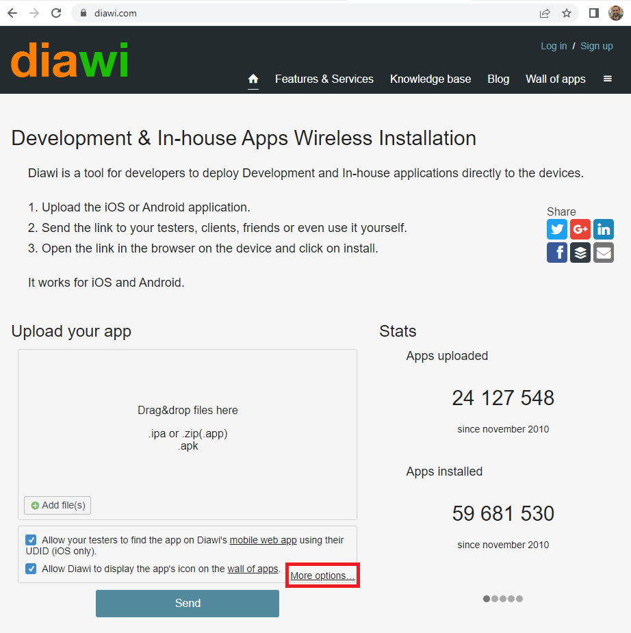
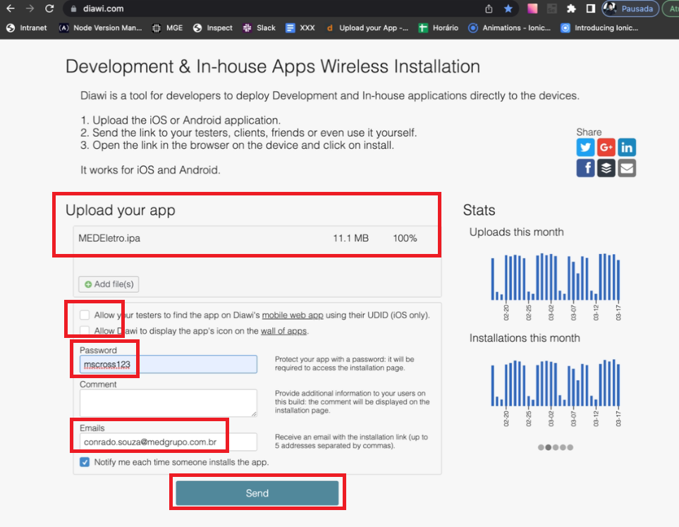
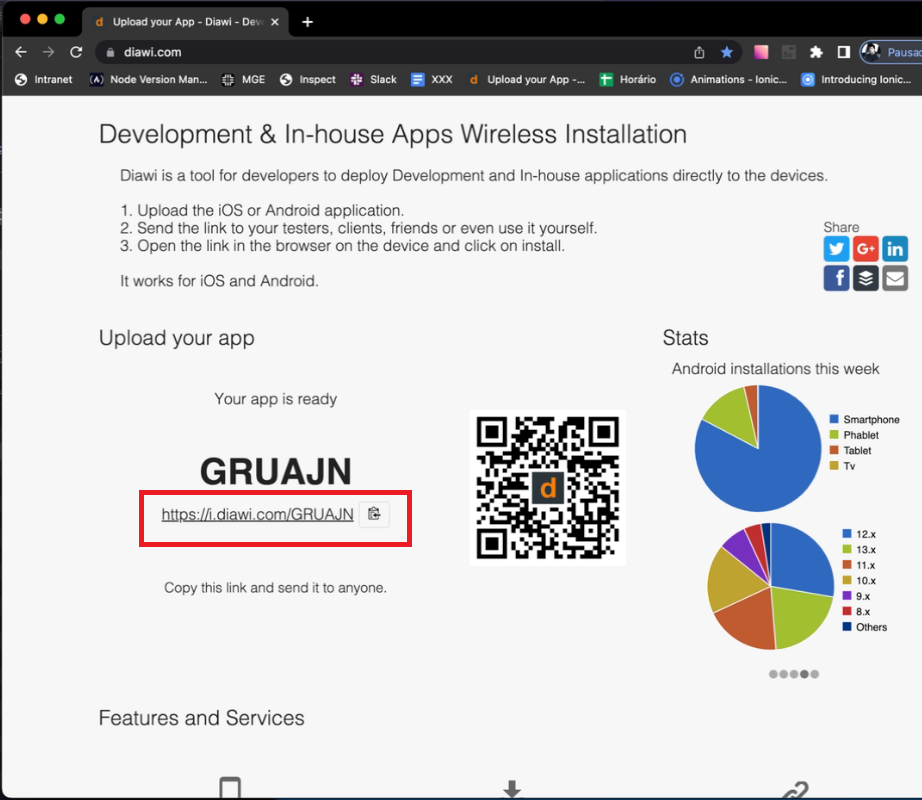

# Diawi

## Criação do link para download do app

Abrir o Google Chrome, entrar no site diawi.com.

```
diawi.com
```

Clicar em "More options...".



Arrastar o arquivo do app (.ipa no caso do IOS, e .apk no caso do Android) para dentro do campo "Upload your app".

Desmarcar os dois checkbox que dizem "Allow ...".

Inserir a senha: mscross123.

Colocar no Email: conrado.souza@medgrupo.com.br.

Clicar em "Send".



O site vai gerar um link para download do app, enviar este link para QAs testarem.


