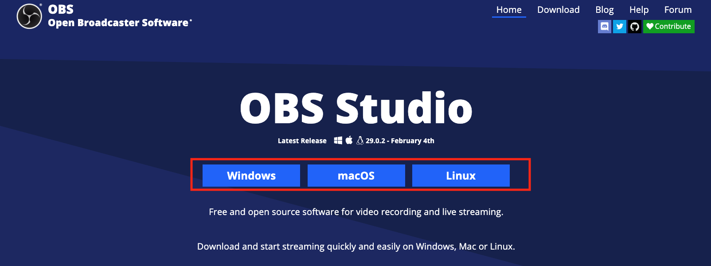
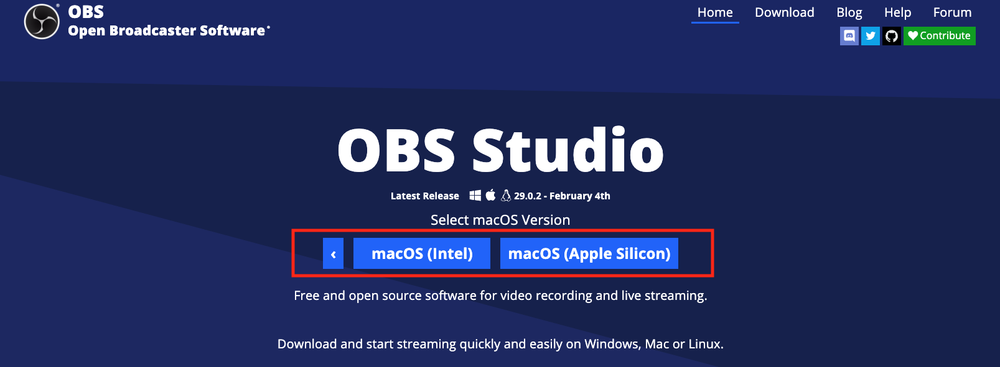
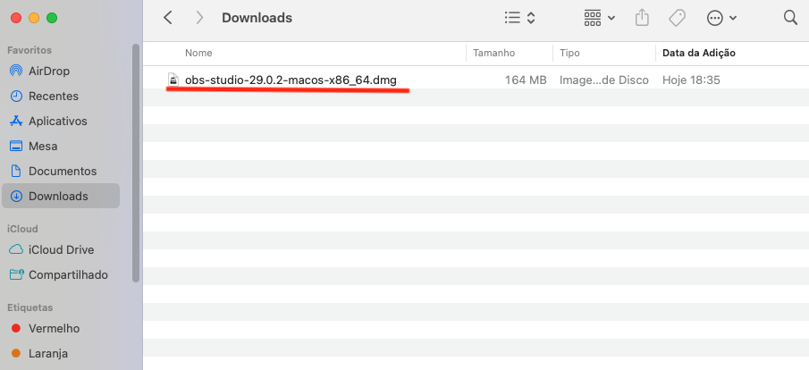
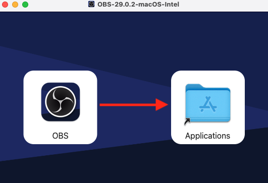
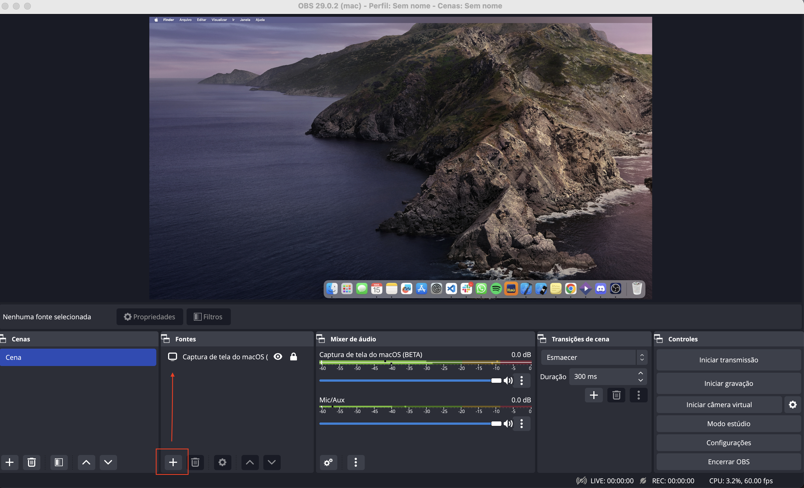
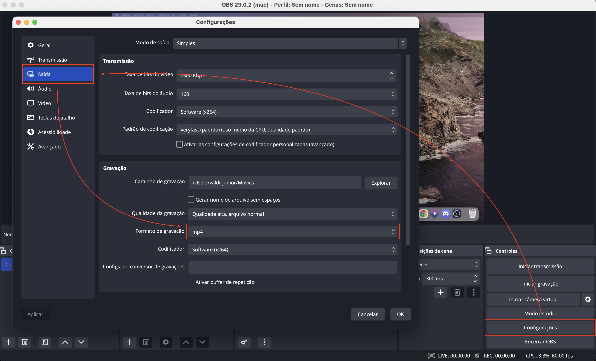
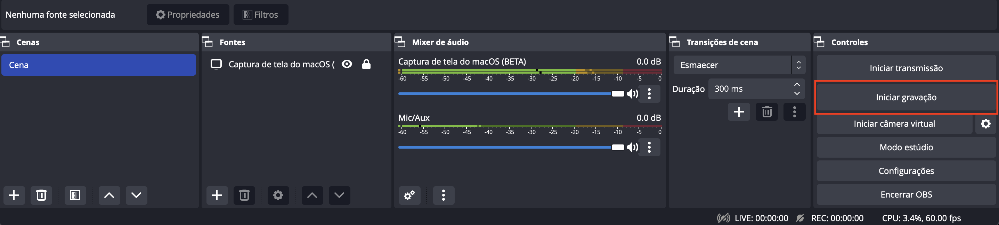
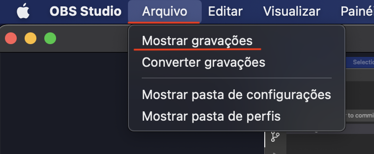
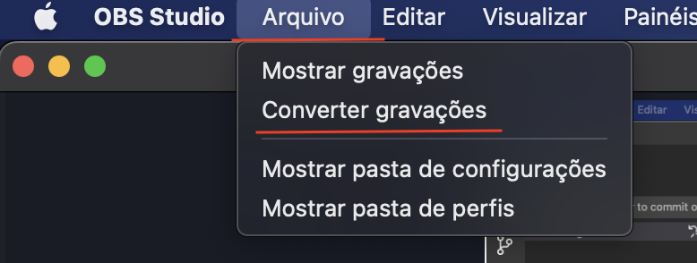
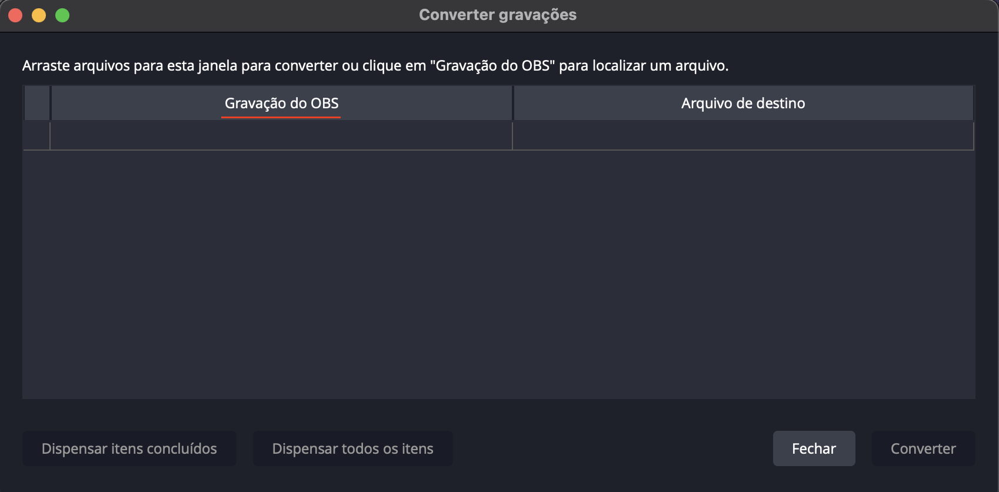

# OBS

- **[Site OBS](https://obsproject.com/)**

## Instalação

### MAC

Selecione o sistema operacional de sua utilização:

Selecione a versão do MacOS:

Abrir o arquivo baixado pelo Finder:

Arraste o Icone OBS para a pasta Application:

#### Configuração

Após abertura do OBS, clicar no Ícone de **"mais"** indicado abaixo e escolha a opção destacada **"Captura de tela do macOS"**:

>Opcional:

Em **"configurações"**, clique em **"Saida"** e no campo **"Formato de gravação"**, altere para **"mp4"**:

### Windows

### Linux

## Desenvolvimento

Clicar em **"Iniciar gravação"** para iniciar a gravação de tela e audio:

>OBS: após finalização da gravação, o arquivo da gravação pode ser exibido clicando em **"arquivo"** e selecionando a opção **"Mostrar Gravações"**.

## Úteis

Caso seja necessario converter a gravação, clicar em **"Arquivo"** e selecionar a opção **"Converter gravações"**.

Preencher gravação do OBS com o arquivo de video que deseja converter.

>OBS: Gravações salvas em mp4 não podem ser convertidas.