# Templarios

## Instalação

### ionic-framework

1. Clonar **[repositório](https://github.com/MEDGRUPOGIT/ionic-framework)**.

2. Instalar Dependências:

```bash
npm install
```

:::note
Utilizar versão do node: **14.17.3**.
:::

3. Entrar na pasta `core`: 

```bash
cd core
```

4. Instalar Dependências:

```bash
npm install
```

### med-components

1. Clonar **[repositório](https://github.com/MEDGRUPOGIT/med-components)**.

2. Instalar Dependências:

```bash
npm install
```

## Desenvolvimento

No projeto **ionic-framework**:

1. Entrar na pasta `core`:

```bash
cd core
```

2. Rodar projeto:

```bash
npm run tp:start
```
:::note
Devido a atualização da versão do storybook, talvez seja necessário deletar a pasta node_modules e package-lock.json e instalar o ionic-framework novamente.
:::

## Fluxo git

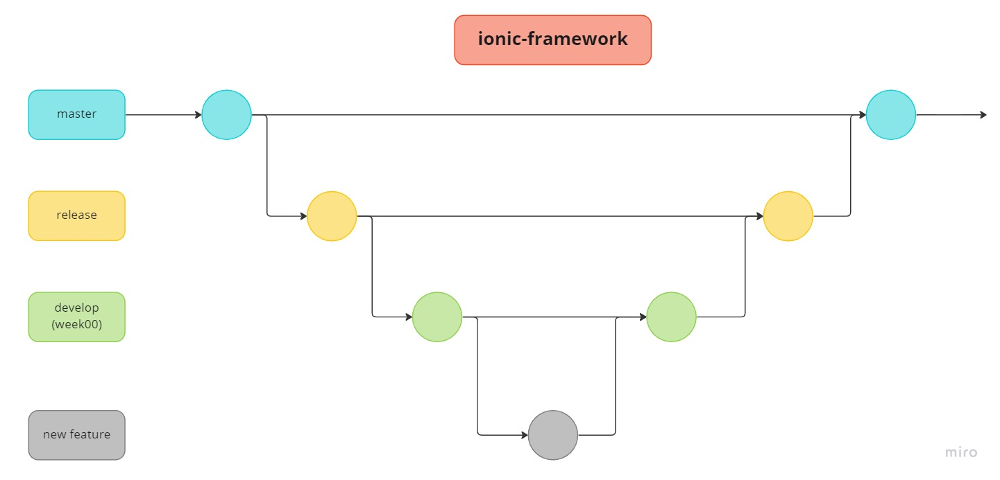

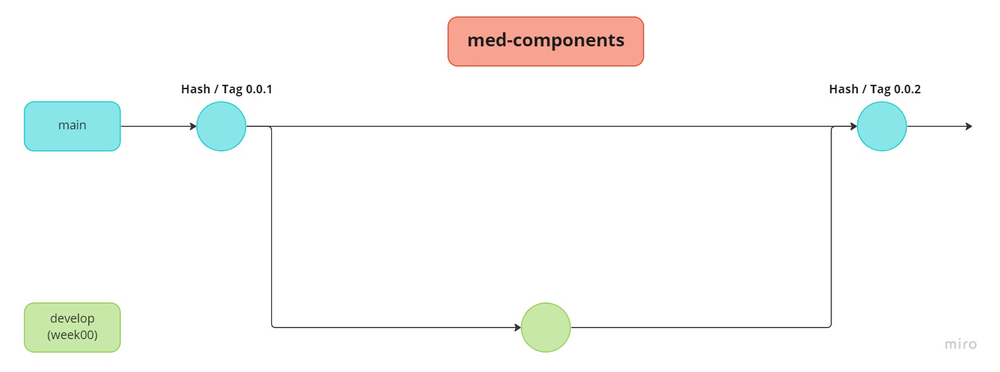

## Publicação 

### Homologação (Hashes)

1. No projeto **ionic-framework**, atualizar a branch de trabalho *(ex: week11)*:

```bash
git pull
```

2. Entrar na pasta `core`:

```bash
cd core
```

3. Gerar build:

```bash
npm run tp:build
```

4. No projeto **med-components**. Atualizar a branch de trabalho *(ex: week11)*:

```bash
git pull
```

5. Após o término da geração do build no projeto **ionic-framework**, copiar as seguintes pastas para o projeto **med-components**:

- @templarios
- css
- dist
- hydrate
- loader
- templarios

6. Selecionar `copy folders`, e após `replace` para todas as pastas:


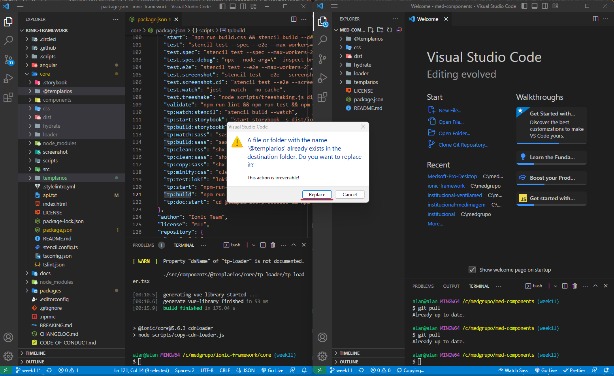

6. No projeto **med-components**, *comitar* os arquivos copiados e dar *push*.

#### Geração de hash

7. No repositório do projeto **[med-component](https://github.com/MEDGRUPOGIT/med-components)**, selecionar a branch de trabalho e clicar no commit que foi feito. *Copiar* a hash criada da URL do navegador:

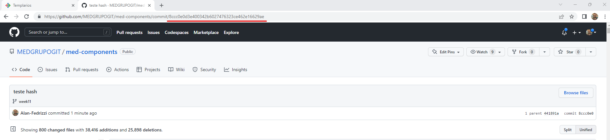

8. Abrir projeto que se deseja testar. Abrir arquivo `package.json`, colar a hash gerada na url do `@ionic/core` nas dependencies. *Abaixo um exemplo do MEDSoft*:

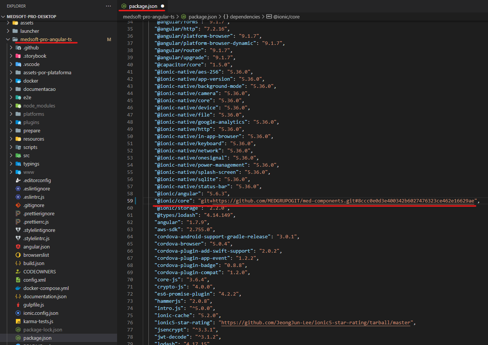

9. Instalar dependências do projeto:

```bash
npm install
```

10. Rodar projeto e verificar as atualizações feitas no DS.

### Produção (Tag)

1. No projeto **ionic-framework**, atualizar a branch de trabalho *(ex: week11)*:

```bash
git pull
```

2. Mudar para branch `release` e atualizar ela:

```bash
git checkout release
```

```bash
git pull
```

3. Mergear a branch de `trabalho` com squash, na release:

```bash
git merge [nome-da-branch] --squash

# comitar e dar push.
```

4. Mudar para branch `master` e atualizar ela:

```bash
git checkout master
```

```bash
git pull
```

5. Mergear a `release` sem squash, na `master`:

```bash
git merge release

# comitar e dar push.
```

6. Entrar na pasta `core`:

```bash
cd core
```

7. Gerar build na branch `master`:

```bash
npm run tp:build
```

8. Abrir projeto **med-components**. Atualizar a branch de `trabalho` *(ex: week11)*:

```bash
git pull
```

9. Mudar para branch `main` e atualizar ela:

```bash
git checkout main
```

```bash
git pull
```

10. Após o término da geração do build no projeto **ionic-framework**, copiar as seguintes pastas para o projeto **med-components**:

- Pastas:
  - @templarios
  - css
  - dist
  - hydrate
  - loader
  - templarios
- Arquivos:
  - LICENSE
  - package.json
  - README.md

11. Selecionar `copy folders`, e após `replace` para todas as pastas:

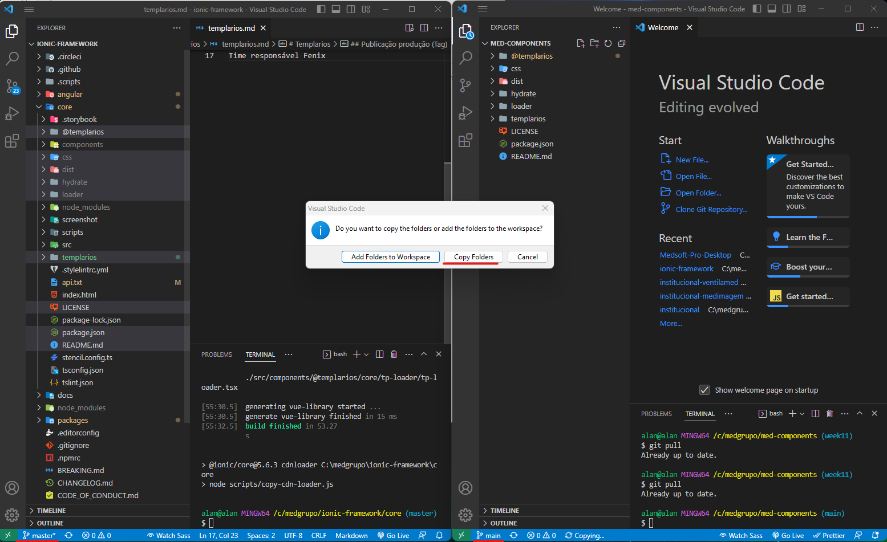

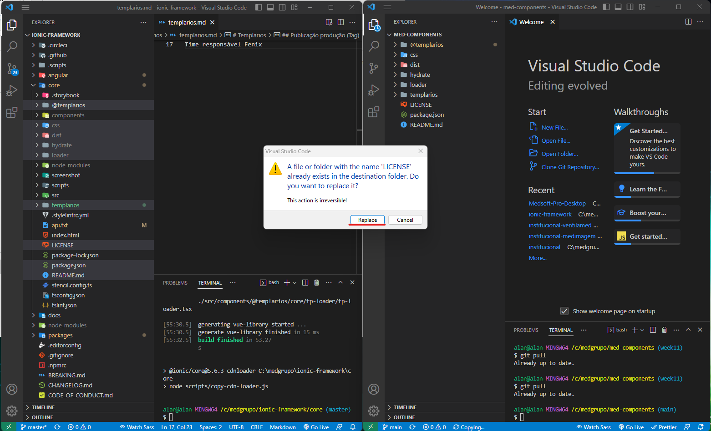

#### Geração de tag

11. No projeto **med-components**, *comitar* os arquivos copiados e dar *push*.

12. Verificar a numeração da última tag (**[repositório med-components/tags](https://github.com/MEDGRUPOGIT/med-components/tags)**), e gerar a próxima tag:

```bash
git tag -a [numero-da-nova-tag] -m "[numero-da-nova-tag]"
```

Após gerada, dar push na tag:

```bash
git push origin --tags
```

13. Acessar o repositório **[med-component](https://github.com/MEDGRUPOGIT/med-components)**, clicar em tags e verificar se a nova tag foi publicada.

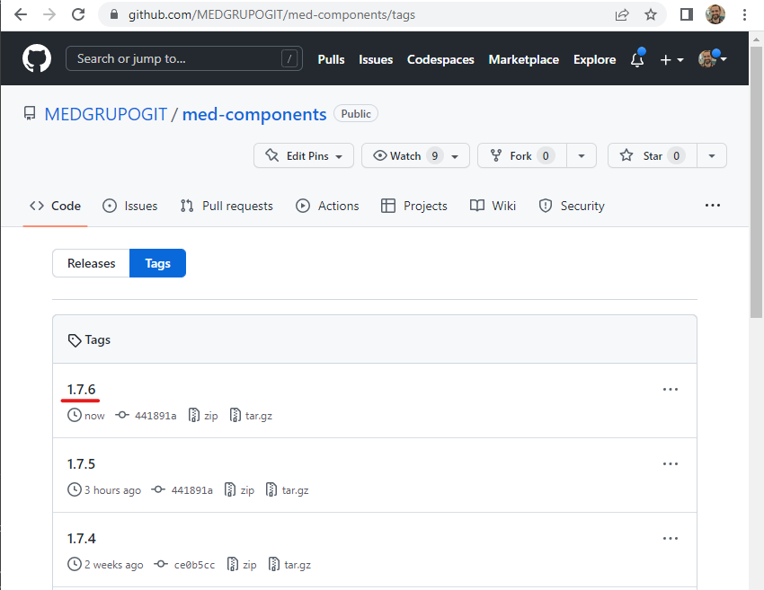

#### Geração de release

14. Na tag gerada, clicar nos três pontos localizados no lado direito > Create release.

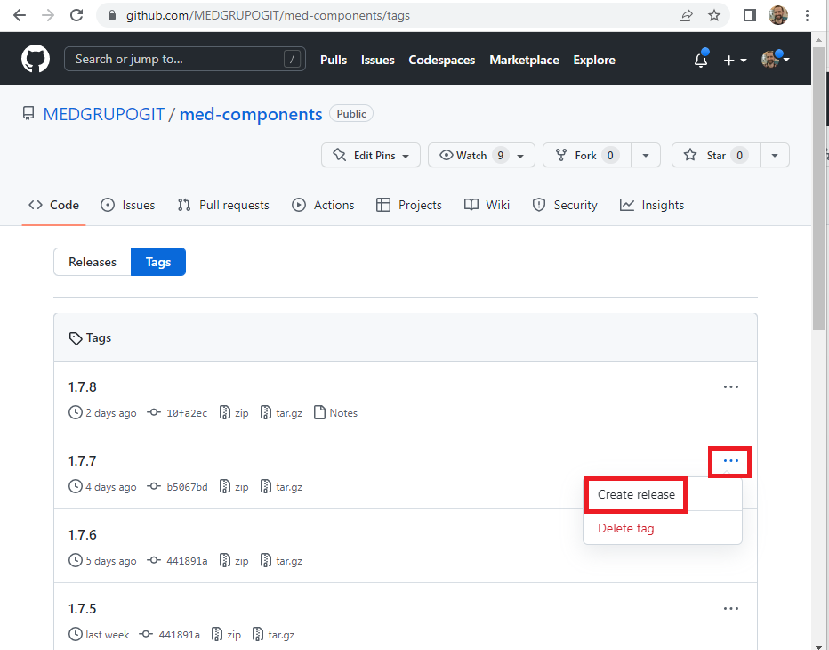

15. Preencher o número da tag e descrever as alterações que foram feitas nos componentes. Clicar em `Publish release`.

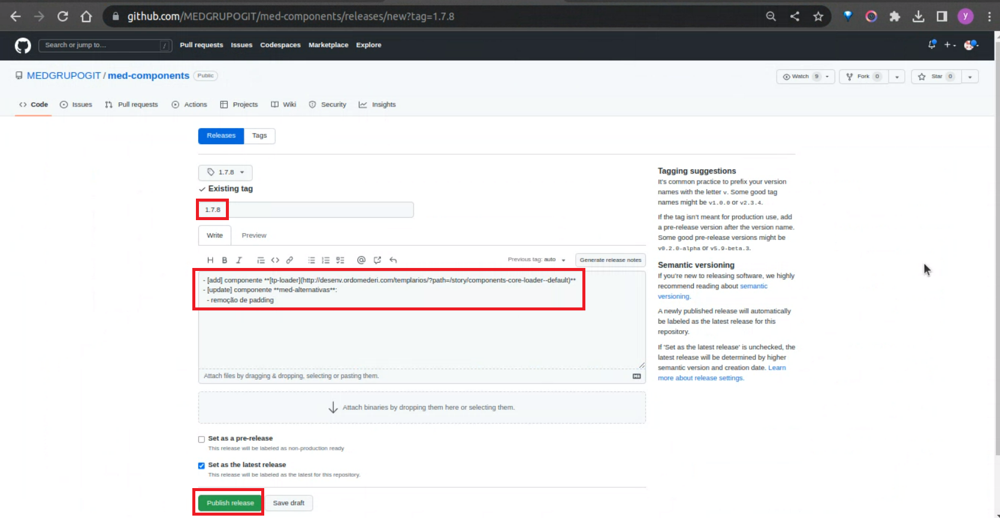

#### Utilização de tag

16. Abrir projeto que se deseja testar. Abrir arquivo `package.json`, colar a hash gerada na url do `@ionic/core` nas dependencies. *Abaixo um exemplo do MEDSoft*:

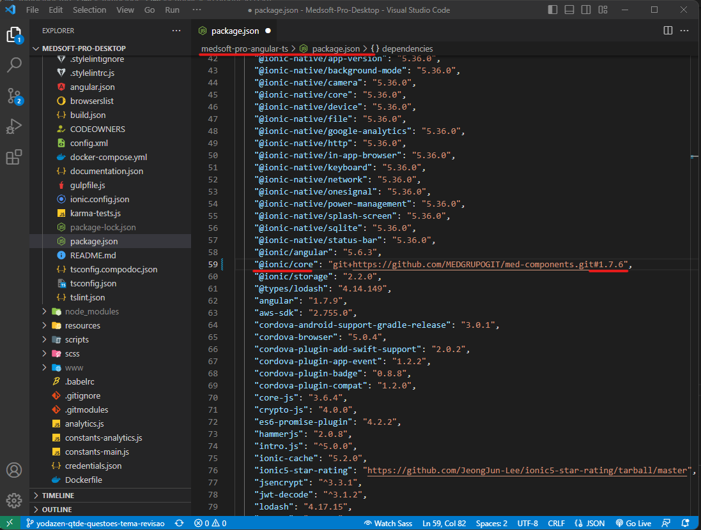

17. Instalar dependências do projeto:

```bash
npm install
```

18. Rodar projeto e verificar as atualizações feitas no DS.

#### Limpeza de branchs após publicação de tag

19. No projetos **ionic-framework**, excluir a branch de `trabalho` *(ex: week11)* e criar nova branch *(ex: week12)* a partir da `release`:

```bash
git checkout release
```

```bash
git checkout -b [nome-da-nova-branch]

# Publicar nova branch de trabalho.
```

20. No projetos **med-components**, excluir a branch de `trabalho` *(ex: week11)* e criar nova branch *(ex: week12)* a partir da `main`:

```bash
git checkout -b [nome-da-nova-branch]

# Publicar nova branch de trabalho.
```

21. Informar os outros membros do time da criação das novas branchs de trabalho.

## Docusaurus

:::note
Utilizar versão do node: **18.14.1**.
:::

1. Entrar na pasta `@templarios/processos`.

```bash
cd @templarios/processos
```

2. Instalar Dependências:

```bash
npm install
```

3. Voltar para a pasta `core`.

#### Rodar projeto

```bash
npm run tp:doc:start
```

#### Buildar projeto

```bash
npm run tp:doc:build
```

## Website Design System

:::note
Versão mínima do node: **14.17.3**.
:::

1. Entrar na pasta `@templarios/website`.

```bash
cd @templarios/website
```

2. Instalar Dependências:

```bash
npm install
```

3. Voltar para a pasta `core`.

#### Rodar projeto

```bash
npm run tp:website:start
```

#### Buildar projeto

```bash
npm run tp:website:build
```

## Resumo

### Branch da semana

- mergear branch `anterior` com squash na `release`
- mergear `release` sem squash com `master`
- criar nova branch a partir `release` *(ex: week10)*

### Geração de tag

- mergear branch `anterior` com squash na `release`
- mergear `release` sem squash com `master`
- gerar build da `master`
- **med-components:** na branch `main` colocar os artefatos, `commitar` *(ex: 1.5.0)* e `push`
- git tag -a `1.5.0` -m `"1.5.0"`
- git push origin --tags